#  Apache Flink Kickstarter II **[UNDER CONSTRUCTION]**

**Apache Flink Kickstarter II** is the 2026 evolution of my original Kickstarter project ─ rebuilt to showcase the cutting edge of **Apache Flink 2.1.x**.

Designed as a hands-on, production-minded accelerator, it brings Flink to life _locally_ on **Confluent Platform + Minikube**, while drawing direct comparisons to **Confluent Cloud for Apache Flink** ─ so you can clearly see what’s possible across environments.

Every **example** is delivered end-to-end ─ from schema design to fully operational streaming pipelines ─ with implementations in **both Java and Python (when possible)** where it matters, bridging real-world developer workflows with modern streaming architecture.

---

**Table of Contents**
<!-- toc -->
+ [**1.0 Prerequisites**](#10-prerequisites)
    - [**1.1 Confluent Platform Local Setup**](#11-confluent-platform-local-setup)
        - [**1.1.1 Required Tools**](#111-required-tools)
        - [**1.1.2 Resource Requirements**](#112-resource-requirements)
        - [**1.1.3 `Makefile` Architecture**](#113-makefile-architecture)
        - [**1.1.4 Using the `Makefile` Targets Quickstart**](#114-using-the-makefile-targets-quickstart)
        - [**1.1.5 `Makefile` Composite Workflow Target Reference**](#115-makefile-composite-workflow-target-reference)
        - [**1.1.6 `Makefile` Individual Target Reference**](#116-makefile-individual-target-reference)
        - [**1.1.7 `Makefile` Target Configuration Reference**](#1170-makefile-target-configuration-reference)
        - [**1.1.8 `Makefile` Target Teardown**](#118-makefile-target-teardown)
    - [**1.2 Confluent Cloud Setup (early access example)**](#12-confluent-cloud-setup-early-access-example)
        - [**1.2.1 Required Tools**](#121-required-tools)
+ [**2.0 The Examples**](#20-the-examples)
+ [**3.0 Debugging a Flink UDF**](#30-debugging-a-flink-udf)
+ [**4.0 Resources**](#40-resources)
<!-- tocstop -->

---

## **1.0 Prerequisites**

### **1.1 Confluent Platform Local Setup**
A Makefile-driven quickstart that deploys a full local streaming stack on Minikube:

- **Confluent Platform** (KRaft mode) via Confluent for Kubernetes (CFK)
- **Apache Flink 2.1.1** via the Confluent Flink Kubernetes Operator 1.130
- **Confluent Manager for Apache Flink (CMF) 2.1** for Flink environment management
- **Kafka UI** ([Provectus](https://provectus.com/)) for cluster inspection

#### **1.1.1 Required Tools**
macOS with Homebrew. To install all required tools in one step:

```bash
make install-prereqs
```

This installs `kubernetes-cli`, `minikube`, `helm`, `gettext`, and `gradle` via Homebrew. Once complete, **launch Docker Desktop** before proceeding.

To verify all tools are present without installing:

```bash
make check-prereqs
```

> Required: `docker`, `kubectl`, `minikube`, `helm`, `envsubst`, and `gradle`.

---

#### **1.1.2 Resource Requirements**

Minikube is configured with the following defaults, which are required to run the full stack:

| Resource | Default |
|----------|---------|
| CPUs | 6 |
| Memory | 20 GB |
| Disk | 50 GB |

Override any of these at the command line:

```bash
make cp-up MINIKUBE_CPUS=8 MINIKUBE_MEM=24576
```

---

#### **1.1.3 `Makefile` Architecture**

```mermaid
graph TD
    %% ── Composite entry points ──────────────────────────────────────────
    CP_UP(["`**make cp-up**`"])
    FLINK_UP(["`**make flink-up**`"])
    CP_DOWN(["`**make cp-down**`"])
    FLINK_DOWN(["`**make flink-down**`"])
    TEARDOWN(["`**make confluent-teardown**`"])

    %% ── Phase 1: Prerequisites ──────────────────────────────────────────
    subgraph P1["Phase 1 — Prerequisites"]
        CHECK_PRE["check-prereqs\ndocker · kubectl · minikube · helm"]
    end

    %% ── Phase 2: Minikube ───────────────────────────────────────────────
    subgraph P2["Phase 2 — Minikube"]
        MK_START["minikube-start\ncpus=6 · mem=20GB · disk=50GB"]
        MK_STOP["minikube-stop"]
    end

    %% ── Phase 3: Confluent Operator ─────────────────────────────────────
    subgraph P3["Phase 3 — Confluent Operator"]
        NS["namespace\nkubectl create namespace confluent"]
        OP_INSTALL["operator-install\nhelm: confluent-for-kubernetes"]
        OP_UNINSTALL["operator-uninstall"]
    end

    %% ── Phase 4: Confluent Platform ─────────────────────────────────────
    subgraph P4["Phase 4 — Confluent Platform"]
        CP_DEPLOY["cp-deploy\nKafka KRaft · SR · Connect\nksqlDB · REST Proxy · C3"]
        CP_DELETE["cp-delete"]
    end

    %% ── Phase 5: Control Center ─────────────────────────────────────────
    subgraph P5["Phase 5 — Control Center"]
        C3["c3-open\nlocalhost:9021"]
    end

    %% ── Phase 6: Apache Flink ───────────────────────────────────────────
    subgraph P6["Phase 6 — Apache Flink"]
        CERT["flink-cert-manager\ncert-manager v1.18.2"]
        FL_OP["flink-operator-install\nhelm: confluentinc/flink-kubernetes-operator 1.130.0"]
        FL_RBAC["flink-rbac\nsupplemental Role + RoleBinding\n(services access for flink SA)"]
        FL_DEPLOY["flink-deploy\nenvsubst → FlinkDeployment CR\ncp-flink:2.1.1-cp1"]
        FL_UI["flink-ui\nlocalhost:8081"]
        FL_DELETE["flink-delete"]
        FL_OP_UN["flink-operator-uninstall"]
        CERT_UN["cert-manager-uninstall"]
    end

    %% ── Phase 7: CMF ────────────────────────────────────────────────────
    subgraph P7["Phase 7 — Confluent Manager for Apache Flink (CMF)"]
        CMF_INSTALL["cmf-install\nhelm: confluent-manager-for-apache-flink 2.1.0"]
        CMF_ENV["cmf-env-create\nPOST /cmf/api/v1/environments"]
        CMF_OPEN["cmf-open\nlocalhost:8080/cmf/api/v1/environments"]
        CMF_PROXY["cmf-proxy-inject\nsocat sidecar → C3 Flink tab"]
        CMF_UN["cmf-uninstall"]
    end

    %% ── Phase 8: Kafka UI ───────────────────────────────────────────────
    subgraph P8["Phase 8 — Kafka UI"]
        KUI_INSTALL["kafka-ui-install\nhelm: provectus/kafka-ui\nbootstrap: kafka:9071"]
        KUI_OPEN["kafka-ui-open\nlocalhost:8080"]
        KUI_UN["kafka-ui-uninstall"]
    end

    %% ── Phase 9: Build & Deploy PTF UDF ─────────────────────────────────
    subgraph P9["Phase 9 — Build & Deploy PTF UDF"]
        BUILD_PTF["build-ptf-udf\n./gradlew clean shadowJar"]
        DEPLOY_CP_PTF["deploy-cp-ptf-udf\ncopy JAR → Flink SQL Client"]
        TEARDOWN_CP_PTF["teardown-cp-ptf-udf"]
        DEPLOY_CC_PTF["deploy-cc-ptf-udf\nJAR → Confluent Cloud"]
        TEARDOWN_CC_PTF["teardown-cc-ptf-udf"]
    end

    %% ── Manifests / Templates ───────────────────────────────────────────
    subgraph FS["k8s/base/"]
        MANIFEST[("flink-basic-deployment.yaml\nFLINK_IMAGE · FLINK_VERSION")]
        RBAC_MANIFEST[("flink-rbac.yaml\nRole + RoleBinding")]
    end

    %% ── make cp-up dependency chain ─────────────────────────────────────
    CP_UP --> CHECK_PRE
    CP_UP --> MK_START
    CP_UP --> CP_CORE_UP
    CP_UP --> KUI_INSTALL

    CP_CORE_UP["cp-core-up"] --> OP_INSTALL
    CP_CORE_UP --> CP_DEPLOY
    OP_INSTALL --> NS

    %% ── make flink-up dependency chain ──────────────────────────────────
    FLINK_UP --> CERT
    FLINK_UP --> FL_OP
    FLINK_UP --> CMF_INSTALL
    FLINK_UP --> CMF_ENV
    FLINK_UP --> FL_DEPLOY
    FL_OP --> NS
    FL_DEPLOY --> FL_RBAC
    FL_DEPLOY --> MANIFEST
    FL_RBAC --> RBAC_MANIFEST

    %% ── make deploy-cp-ptf-udf dependency chain ─────────────────────────
    DEPLOY_CP_PTF --> BUILD_PTF

    %% ── make deploy-cc-ptf-udf dependency chain ─────────────────────────
    DEPLOY_CC_PTF --> BUILD_PTF

    %% ── make cp-down dependency chain ────────────────────────────────────
    CP_DOWN --> KUI_UN
    CP_DOWN --> CP_DELETE
    CP_DOWN --> OP_UNINSTALL

    %% ── make flink-down dependency chain ─────────────────────────────────
    FLINK_DOWN --> FL_DELETE
    FLINK_DOWN --> CMF_UN
    FLINK_DOWN --> FL_OP_UN
    FLINK_DOWN --> CERT_UN

    %% ── make confluent-teardown ───────────────────────────────────────────
    TEARDOWN -->|"1 — check minikube running"| FLINK_DOWN
    TEARDOWN -->|"2"| CP_DOWN
    TEARDOWN -->|"3 — delete namespace"| NS
    TEARDOWN -->|"4"| MK_STOP

    %% ── UI access ────────────────────────────────────────────────────────
    CP_DEPLOY -.->|"once Running"| C3
    FL_DEPLOY -.->|"once Running"| FL_UI
    CMF_INSTALL -.->|"once Running"| CMF_OPEN
    CMF_INSTALL -.->|"C3 Flink tab"| CMF_PROXY
    KUI_INSTALL -.->|"once Running"| KUI_OPEN

    %% ── Styles ───────────────────────────────────────────────────────────
    classDef entry    fill:#1a1a2e,stroke:#e94560,color:#fff,font-weight:bold
    classDef install  fill:#16213e,stroke:#0f3460,color:#a8dadc
    classDef remove   fill:#2d1b1b,stroke:#8b0000,color:#ffb3b3
    classDef ui       fill:#1b2d1b,stroke:#2d6a2d,color:#b3ffb3
    classDef file     fill:#2d2b1b,stroke:#8b7500,color:#ffe680
    classDef composite fill:#2a1a2e,stroke:#9b59b6,color:#dbb8ff

    class CP_UP,FLINK_UP,CP_DOWN,FLINK_DOWN,TEARDOWN entry
    class CP_CORE_UP,DEPLOY_CP_PTF,DEPLOY_CC_PTF composite
    class CHECK_PRE,MK_START,NS,OP_INSTALL,CP_DEPLOY,CERT,FL_OP,FL_RBAC,FL_DEPLOY,CMF_INSTALL,CMF_ENV,CMF_PROXY,KUI_INSTALL,BUILD_PTF install
    class MK_STOP,OP_UNINSTALL,CP_DELETE,FL_DELETE,FL_OP_UN,CERT_UN,CMF_UN,KUI_UN,TEARDOWN_CP_PTF,TEARDOWN_CC_PTF remove
    class C3,FL_UI,CMF_OPEN,KUI_OPEN ui
    class MANIFEST,RBAC_MANIFEST file
```



---

#### **1.1.4 Using the `Makefile` Targets Quickstart**

##### **1.1.4.1 Full stack (CP + Kafka UI)**

```bash
make cp-up
```

This runs: `check-prereqs` → `minikube-start` → `namespace` → `operator-install` → `cp-deploy` → `kafka-ui-install`.

Once pods are up, open Control Center:

```bash
make c3-open        # http://localhost:9021
```

##### **1.1.4.2 Add Apache Flink + CMF (run separately after `make cp-up`)**

```bash
make flink-up
```

This runs: `flink-cert-manager` → `flink-operator-install` → `cmf-install` → `cmf-env-create` → `flink-deploy`. `flink-up` is self-contained and can also be run standalone on a fresh cluster.

Once the Flink JobManager pod is running:

```bash
make flink-ui       # http://localhost:8081 (background — returns prompt)
make flink-ui-stop  # stop the background port-forward
make cmf-open       # http://localhost:8080/cmf/api/v1/environments
```

To expose the Flink tab inside Control Center, inject the CMF proxy sidecar:

```bash
make cmf-proxy-inject
```

---

#### **1.1.5 `Makefile` Composite Workflow Target Reference**

| Target | What it does |
|--------|-------------|
| `make cp-up` | Full stack: Minikube + CP + Kafka UI |
| `make flink-up` | cert-manager + Confluent Flink Operator + CMF + Flink cluster |
| `make cp-down` | Remove CP, Kafka UI, and Operator (Minikube keeps running) |
| `make flink-down` | Remove Flink cluster, CMF, Operator, and cert-manager |
| `make confluent-teardown` | Full teardown: everything + stop Minikube |

---

#### **1.1.6 `Makefile` Individual Target Reference**

<details>
<summary>Phase 1 — Prerequisites</summary>
    
| Target | Description |
|--------|-------------|
| `install-prereqs` | Install Docker Desktop, kubectl, Minikube, Helm, envsubst, and Gradle via Homebrew |
| `check-prereqs` | Verify all required tools are available |
</details>

<details>
<summary>Phase 2 — Minikube</summary>

| Target | Description |
|--------|-------------|
| `minikube-start` | Start Minikube with configured resources |
| `minikube-status` | Show Minikube and node status |
| `minikube-stop` | Stop the Minikube cluster |
| `minikube-delete` | Permanently delete the Minikube cluster |
</details>

<details>
<summary>Phase 3 — Confluent Operator</summary>

| Target | Description |
|--------|-------------|
| `namespace` | Create the `confluent` namespace and set it as default context |
| `operator-install` | Add Confluent Helm repo and install CFK Operator |
| `operator-status` | Show CFK Operator pod status |
| `operator-uninstall` | Remove the CFK Operator Helm release |
</details>

<details>
<summary>Phase 4 — Confluent Platform</summary>

| Target | Description |
|--------|-------------|
| `cp-deploy` | Deploy Kafka (KRaft), Schema Registry, Connect, ksqlDB, REST Proxy, Control Center |
| `cp-watch` | Watch pod startup live (Ctrl+C to exit) |
| `cp-status` | Show current pod status |
| `cp-delete` | Remove all CP components and leftover PVCs |
</details>

<details>
<summary>Phase 5 — Control Center</summary>

| Target | Description |
|--------|-------------|
| `c3-open` | Port-forward Control Center in the background and open `http://localhost:9021` (`make c3-stop` to kill) |
| `c3-stop` | Stop the background Control Center port-forward |
</details>

<details>
<summary>Phase 6 — Apache Flink</summary>

| Target | Description |
|--------|-------------|
| `flink-cert-manager` | Install cert-manager (Confluent Flink Operator dependency) |
| `flink-operator-install` | Install the Confluent Flink Kubernetes Operator (`confluentinc/flink-kubernetes-operator`) |
| `flink-operator-status` | Show Flink Operator pod status |
| `flink-operator-uninstall` | Remove the Confluent Flink Operator Helm release |
| `flink-rbac` | Apply supplemental RBAC so the `flink` SA can read services (needed for job submission) |
| `flink-deploy` | Deploy the Flink session cluster using `FLINK_MANIFEST` (runs `flink-rbac` first) |
| `flink-status` | Show Flink pods and FlinkDeployment CRs |
| `flink-ui` | Port-forward Flink UI in the background and open `http://localhost:8081` (`make flink-ui-stop` to kill) |
| `flink-ui-stop` | Stop the background Flink UI port-forward |
| `flink-delete` | Delete the Flink session cluster |
| `cert-manager-uninstall` | Remove cert-manager |
</details>

<details>
<summary>Phase 7 — Confluent Manager for Apache Flink (CMF)</summary>

| Target | Description |
|--------|-------------|
| `cmf-install` | Install CMF via Helm (`confluent-manager-for-apache-flink`) and wait for pod readiness |
| `cmf-env-create` | Create a Flink environment (`CMF_ENV_NAME`) in CMF pointing to the `confluent` namespace |
| `cmf-status` | Show CMF pod status and list registered Flink environments |
| `cmf-open` | Port-forward CMF REST API and open `http://localhost:8080/cmf/api/v1/environments` |
| `cmf-uninstall` | Uninstall CMF (safe to run even if not installed) |
| `cmf-proxy-inject` | Patch the C3 StatefulSet with a `socat` sidecar to expose the Flink tab in Control Center |
| `cmf-proxy-remove` | Remove the CMF proxy sidecar and resume CFK reconciliation |
| `cmf-proxy-logs` | Stream logs from the `cmf-proxy` sidecar in the C3 pod |
</details>

<details>
<summary>Phase 8 — Kafka UI (Provectus)</summary>

| Target | Description |
|--------|-------------|
| `kafka-ui-install` | Install Kafka UI connected to the local CP cluster (Kafka + Schema Registry + Connect) |
| `kafka-ui-status` | Show Kafka UI pod status |
| `kafka-ui-open` | Port-forward Kafka UI and open `http://localhost:8080` |
| `kafka-ui-uninstall` | Remove Kafka UI |
</details>

<details>
<summary>Phase 9 — Build & Deploy Flink JARs</summary>

| Target | Description |
|--------|-------------|
| `build-ptf-udf` | Build the `ptf_udf` fat JAR (requires Gradle) |
| `deploy-cp-ptf-udf` | Build UDF JAR, copy to Flink pods, and submit SQL via CMF |
| `teardown-cp-ptf-udf` | Tear down the SQL-based ptf_udf deployment via CMF |
</details>

---

#### **1.1.7.0 `Makefile` Target Configuration Reference**

All variables are overridable at the command line.

<details>
<summary>Defaults</summary>

| Variable | Default | Description |
|----------|---------|-------------|
| `NAMESPACE` | `confluent` | Kubernetes namespace |
| `CONFLUENT_MANIFEST` | `k8s/base/confluent-platform-c3++.yaml` | Path to Confluent Platform manifest |
| `MINIKUBE_CPUS` | `6` | vCPUs allocated to Minikube |
| `MINIKUBE_MEM` | `20480` | Memory in MB |
| `MINIKUBE_DISK` | `50g` | Disk size |
| `FLINK_OPERATOR_VER` | `1.130.0` | Confluent Flink Kubernetes Operator version |
| `FLINK_IMAGE` | `confluentinc/cp-flink:2.1.1-cp1-java21-arm64` | Flink container image |
| `FLINK_VERSION` | `v2_1` | Flink API version string for the FlinkDeployment CR |
| `FLINK_CLUSTER_NAME` | `flink-basic` | Name of the FlinkDeployment resource |
| `FLINK_MANIFEST` | `k8s/base/flink-basic-deployment.yaml` | Path to FlinkDeployment template |
| `FLINK_RBAC_MANIFEST` | `k8s/base/flink-rbac.yaml` | Path to supplemental RBAC manifest for the `flink` ServiceAccount |
| `CERT_MANAGER_VER` | `v1.18.2` | cert-manager version |
| `CMF_VER` | `2.1.0` | Confluent Manager for Apache Flink version |
| `CMF_PORT` | `8080` | CMF REST API local port |
| `CMF_ENV_NAME` | `dev-local` | Flink environment name registered in CMF |
| `C3_PORT` | `9021` | Control Center local port |
| `FLINK_UI_PORT` | `8081` | Flink UI local port |
| `KAFKA_UI_PORT` | `8080` | Kafka UI local port |
| `PTF_UDF_TOPICS` | `user_events enriched_events` | Kafka topics for the ptf_udf Flink job |
</details>

> **Note:** CMF uses the Confluent-packaged Flink operator (`confluentinc/flink-kubernetes-operator`) and `confluentinc/cp-flink` images — not the Apache OSS Flink operator or `flink` Docker Hub image.

Example — deploy a specific Flink image:

```bash
make flink-deploy FLINK_IMAGE=confluentinc/cp-flink:2.1.1-cp1-java21-arm64 FLINK_VERSION=v2_1
```

---

#### **1.1.8 `Makefile` Target Teardown**

Remove everything and stop Minikube:

```bash
make confluent-teardown
```

To keep Minikube running but remove all deployed components:

```bash
make flink-down   # Flink cluster + CMF + operator + cert-manager
make cp-down      # CP + Kafka UI + CFK Operator
```

---

### **1.2 Confluent Cloud Setup (early access example)**

#### **1.2.1 Required Tools**

Before you begin, ensure you have access to the following cloud accounts:

* **[Confluent Cloud Account](https://confluent.cloud/)** — for Kafka and Schema Registry resources
* **[Terraform Cloud Account](https://app.terraform.io/)** — for automated infrastructure provisioning

Make sure the following tools are installed on your local machine:

* **[Confluent CLI version 4 or higher](https://docs.confluent.io/confluent-cli/4.0/overview.html)**
* **[Java JDK 17](https://www.oracle.com/java/technologies/javase/jdk17-archive-downloads.html)**
* **[Terraform CLI version 1.13.0 or higher](https://developer.hashicorp.com/terraform/install)**

---

## **2.0 The Examples**

Once the platform is up, head to the examples:

| Example Type | Example Description | Confluent Platform + Minikube | Confluent Cloud |
| --- | --- | --- | --- |
| PTF UDF-type (state-driven) | Walks through building, deploying, and testing a stateful **ProcessTableFunction** that enriches Kafka user events with per-user session tracking. | <p style="text-align: center;">[`CP Deploy`](examples/ptf_udf/cp_deploy/README.md)</p> | <p style="text-align: center;">[`CC Deploy`](examples/ptf_udf/cc_deploy/README.md)</p> |

---

## **3.0 Debugging a Flink UDF**

You can attach VSCode's debugger to a running Flink TaskManager and hit breakpoints inside your UDF code — even though it's executing on a remote JVM inside Kubernetes. The FlinkDeployment CR already has JDWP enabled and the VSCode launch configuration is pre-wired.

**Prerequisites:** The Confluent Platform and Flink stack must be running (`make cp-up && make flink-up`), and your UDF must be deployed (`make deploy-cp-ptf-udf`).

1. **Set a breakpoint** — open [`UserEventEnricher.java`](examples/ptf_udf/java/app/src/main/java/ptf/UserEventEnricher.java) and click in the gutter at the first line of the `eval()` method (line 92):

    ```java
    String eventType = input.getFieldAs("event_type");
    ```

2. **Attach the debugger** — open the **Run and Debug** panel (`Shift+Cmd+D`), select **"Attach to Flink TaskManager"** from the dropdown, and press **F5**. VSCode will automatically port-forward to the TaskManager pod and attach to the JDWP agent on port `5005`.

3. **Send a test event** — produce a single JSON message to the `user_events` topic to trigger the breakpoint:

    ```bash
    make produce-user-events-record
    ```

4. **Debug** — VSCode will pause at your breakpoint. You can inspect `input`, `state`, and local variables, step through the session logic, and watch `state.sessionId` and `state.eventCount` update as you step over lines.

> For the full deep-dive (how JDWP is configured, how port-forwarding works, important caveats), see [Remote Debugging a Flink PTF UDF](examples/ptf_udf/java/remote-debugging-flink-ptf_udf.md).

---
## **4.0 Resources**
- [Manage Confluent Platform with Confluent for Kubernetes](https://docs.confluent.io/operator/current/co-manage-overview.html)

- [Get Started with Confluent Platform for Apache Flink](https://docs.confluent.io/platform/current/flink/get-started/overview.html)
