#  Apache Flink Kickstarter II **[UNDER CONSTRUCTION]**

> **_On GitHub, Watch → Custom → Releases is the most useful setting if you want to stay updated on when something important is released for this project._**

**Apache Flink Kickstarter II** is the 2026 evolution of my original Kickstarter project ─ rebuilt to showcase the cutting edge of **Apache Flink 2.1.x**.

Designed as a hands-on, production-minded accelerator, it brings Flink to life _locally_ on **Confluent Platform on Minikube**, while drawing direct comparisons to **Confluent Cloud for Apache Flink** ─ so you can clearly see what’s possible across environments.

Every **example** is delivered end-to-end ─ from schema design to fully operational streaming pipelines ─ with implementations in **both Java and Python (when possible)** where it matters, bridging real-world developer workflows with modern streaming architecture.

---

**Table of Contents**
<!-- toc -->
+ [**1.0 Prerequisites**](#10-prerequisites)
    - [**1.1 Confluent Platform on Minikube — Production-Like Streaming, Running Locally**](#11-confluent-platform-on-minikube--production-like-streaming-running-locally)
        - [**1.1.1 Requirements**](#111-requirements)
        - [**1.1.2 Local Infrastructure Deployment Made Simple with a `Makefile`**](#112-local-infrastructure-deployment-made-simple-with-a-makefile)
            - [**1.1.2.1 Install the Tooling (One Command Setup)**](#1121-install-the-tooling-one-command-setup)
            - [**1.1.2.2 Full stack (CP + Kafka UI)**](#1122-full-stack-cp--kafka-ui)
            - [**1.1.2.3 Add Apache Flink + CMF (run separately after `make cp-up`)**](#1123-add-apache-flink--cmf-run-separately-after-make-cp-up)
        - [**1.1.3 `Makefile` Composite Workflow Target Reference**](#113-makefile-composite-workflow-target-reference)
        - [**1.1.4 `Makefile` Individual Target Reference**](#114-makefile-individual-target-reference)
        - [**1.1.5 `Makefile` Target Configuration Reference**](#115-makefile-target-configuration-reference)
        - [**1.1.6 Remote Server Setup (SSH Tunneling)**](#116-remote-server-setup-ssh-tunneling)
    - [**1.2 Confluent Cloud Setup**](#12-confluent-cloud-setup)
        - [**1.2.1 Requirements**](#121-requirements)
+ [**2.0 The Examples**](#20-the-examples)
    - [**2.1 Apache Flink User-Defined Functions (UDF)**](#21-apache-flink-user-defined-functions-udf)
        - [**2.1.1 Process Table Functions (PTF)**](#211-process-table-functions-ptf)
+ [**3.0 Debugging the Examples**](#30-debugging-the-examples)
    - [**3.1 Apache Flink UDF Debugging with Java Debug Wire Protocol (JDWP)**](#31-apache-flink-udf-debugging-with-java-debug-wire-protocol-jdwp)
        - [**3.1.1 Process Table Functions (PTF)**](#311-process-table-functions-ptf)
            - [**3.1.1.1 Debugging the row-driven PTF using set semantics (`UserEventEnricher`)**](#3111-debugging-the-row-driven-ptf-using-set-semantics-usereventenricher)
            - [**3.1.1.2 Debugging the row-driven PTF using row semantics (`OrderLineExpander`)**](#3112-debugging-the-row-driven-ptf-using-row-semantics-orderlineexpander)
            - [**3.1.1.3 Debugging the timer-driven PTFs (`SessionTimeoutDetector`, `AbandonedCartDetector`, `PerEventFollowUp`, and `SlaMonitor`)**](#3113-debugging-the-timer-driven-ptfs-sessiontimeoutdetector-abandonedcartdetector-pereventfollowup-and-slamonitor)
+ [**4.0 Resources**](#40-resources)
    - [**4.1 Confluent for Kubernetes (CfK)**](#41-confluent-for-kubernetes-cfk)
    - [**4.2 Confluent Platform for Apache Flink**](#42-confluent-platform-for-apache-flink)
    - [**4.3 Confluent Cloud for Apache Flink (CCAF)**](#43-confluent-cloud-for-apache-flink-ccaf)
<!-- tocstop -->

---

## **1.0 Prerequisites**

### **1.1 Confluent Platform on Minikube — Production-Like Streaming, Running Locally**
To **_run_**, **_test_**, and **_debug_** Apache Flink like a production engineer, this project provides a full Confluent Platform stack running locally on [Minikube](https://minikube.sigs.k8s.io/docs/) — no cloud required.

You get a production-like environment on your laptop:

- **Confluent Platform** (KRaft mode) via Confluent for Kubernetes (CFK)
- **Apache Flink 2.1.1** via the Confluent Flink Kubernetes Operator 1.130
- **Confluent Manager for Apache Flink (CMF) 2.1** for Flink environment management
- **Kafka UI** ([Provectus](https://provectus.com/)) for cluster inspection

The included [`Makefile`](https://makefiletutorial.com/) acts as your control plane—automating setup, teardown, and day-to-day workflows—so you can focus on building Flink pipelines, not infrastructure.

> Build locally. Debug with confidence. Deploy to production-ready environments.

#### **1.1.1 Requirements**

To run this project, you’ll need **macOS (with Homebrew)** or **Linux (with apt-get)**.

The full stack — **Minikube + Confluent Platform + Flink + CMF + Kafka UI** — is resource-intensive and designed to mirror a production-like environment. The following defaults are recommended:

| Resource | Default |
| -------- | ------- |
| CPUs     | 6       |
| Memory   | 20 GB   |
| Disk     | 50 GB   |

> These settings ensure stable performance across all components. You can tune them if needed, but lower resources may lead to pod restarts or degraded performance.

#### **1.1.2 Local Infrastructure Deployment Made Simple with a `Makefile`**

**`Makefile` Architecture**

```mermaid
graph TD
    %% ── Composite entry points ──────────────────────────────────────────
    CP_UP(["`**make cp-up**`"])
    FLINK_UP(["`**make flink-up**`"])
    CP_DOWN(["`**make cp-down**`"])
    FLINK_DOWN(["`**make flink-down**`"])
    TEARDOWN(["`**make confluent-teardown**`"])
    NUKE(["`**make nuke**`"])

    %% ── Phase 1: Prerequisites ──────────────────────────────────────────
    subgraph P1["Phase 1 — Prerequisites"]
        INSTALL_PRE["install-prereqs\ndocker · kubectl · minikube\nhelm · gettext · gradle · openjdk-21"]
        CHECK_PRE["check-prereqs\ndocker · kubectl · minikube · helm · java 21"]
        UNINSTALL_PRE["uninstall-prereqs\nremove all installed tooling"]
    end

    %% ── Phase 2: Minikube ───────────────────────────────────────────────
    subgraph P2["Phase 2 — Minikube"]
        MK_START["minikube-start\ncpus=6 · mem=20GB · disk=50GB"]
        MK_STOP["minikube-stop"]
        MK_DELETE["minikube-delete"]
    end

    %% ── Phase 3: Confluent Operator ─────────────────────────────────────
    subgraph P3["Phase 3 — Confluent Operator"]
        NS["namespace\nkubectl create namespace confluent"]
        OP_INSTALL["operator-install\nhelm: confluent-for-kubernetes"]
        OP_UNINSTALL["operator-uninstall"]
    end

    %% ── Phase 4: Confluent Platform ─────────────────────────────────────
    subgraph P4["Phase 4 — Confluent Platform"]
        CP_DEPLOY["cp-deploy\nKafka KRaft · SR · Connect\nksqlDB · REST Proxy · C3"]
        CP_DELETE["cp-delete"]
    end

    %% ── Phase 5: Control Center ─────────────────────────────────────────
    subgraph P5["Phase 5 — Control Center"]
        C3["c3-open\nlocalhost:9021"]
    end

    %% ── Phase 6: Apache Flink ───────────────────────────────────────────
    subgraph P6["Phase 6 — Apache Flink"]
        CERT["flink-cert-manager\ncert-manager v1.18.2"]
        FL_OP["flink-operator-install\nhelm: confluentinc/flink-kubernetes-operator 1.130.0"]
        FL_RBAC["flink-rbac\nsupplemental Role + RoleBinding\n(services access for flink SA)"]
        FL_DEPLOY["flink-deploy\nenvsubst → FlinkDeployment CR\ncp-flink:2.1.1-cp1"]
        FL_UI["flink-ui\nlocalhost:8081"]
        FL_DELETE["flink-delete"]
        FL_OP_UN["flink-operator-uninstall"]
        CERT_UN["cert-manager-uninstall"]
    end

    %% ── Phase 7: CMF ────────────────────────────────────────────────────
    subgraph P7["Phase 7 — Confluent Manager for Apache Flink (CMF)"]
        CMF_INSTALL["cmf-install\nhelm: confluent-manager-for-apache-flink 2.1.0"]
        CMF_ENV["cmf-env-create\nPOST /cmf/api/v1/environments"]
        CMF_OPEN["cmf-open\nlocalhost:8080/cmf/api/v1/environments"]
        CMF_PROXY["cmf-proxy-inject\nsocat sidecar → C3 Flink tab"]
        CMF_UN["cmf-uninstall"]
    end

    %% ── Phase 8: Kafka UI ───────────────────────────────────────────────
    subgraph P8["Phase 8 — Kafka UI"]
        KUI_INSTALL["kafka-ui-install\nhelm: provectus/kafka-ui\nbootstrap: kafka:9071"]
        KUI_OPEN["kafka-ui-open\nlocalhost:8080"]
        KUI_UN["kafka-ui-uninstall"]
    end

    %% ── Phase 9: Build & Deploy PTF UDFs ────────────────────────────────
    subgraph P9["Phase 9 — Build & Deploy PTF UDFs"]
        BUILD_PTF_SD["build-ptf-udf-row-driven\n./gradlew clean shadowJar\n(2 UDFs in one JAR)"]
        DEPLOY_CP_PTF_SD["deploy-cp-ptf-udf-row-driven\ncopy JAR → Flink SQL Client\n(2 row-driven pipelines)"]
        TEARDOWN_CP_PTF_SD["teardown-cp-ptf-udf-row-driven"]
        DEPLOY_CC_PTF_SD["deploy-cc-ptf-udf-row-driven\nJAR → Confluent Cloud\n(2 row-driven pipelines)"]
        TEARDOWN_CC_PTF_SD["teardown-cc-ptf-udf-row-driven"]
        PRODUCE_UE["produce-user-events-record\nkafka-console-producer → user_events"]
        PRODUCE_OR["produce-orders-record\nkafka-console-producer → orders"]
        BUILD_PTF_TD["build-ptf-udf-timer-driven\n./gradlew clean shadowJar\n(4 UDFs in one JAR)"]
        DEPLOY_CP_PTF_TD["deploy-cp-ptf-udf-timer-driven\ncopy JAR → Flink SQL Client\n(4 timer-driven pipelines)"]
        TEARDOWN_CP_PTF_TD["teardown-cp-ptf-udf-timer-driven"]
        DEPLOY_CC_PTF_TD["deploy-cc-ptf-udf-timer-driven\nJAR → Confluent Cloud\n(4 timer-driven pipelines)"]
        TEARDOWN_CC_PTF_TD["teardown-cc-ptf-udf-timer-driven"]
        PRODUCE_UA["produce-user-activity-record\nkafka-console-producer → user_activity"]
        PRODUCE_UAC["produce-user-actions-record\nkafka-console-producer → user_actions"]
        PRODUCE_SR["produce-service-requests-record\nkafka-console-producer → service_requests"]
        PRODUCE_CE["produce-cart-events-record\nkafka-console-producer → cart_events"]
    end

    %% ── Manifests / Templates ───────────────────────────────────────────
    subgraph FS["k8s/base/"]
        MANIFEST[("flink-basic-deployment.yaml\nFLINK_IMAGE · FLINK_VERSION")]
        RBAC_MANIFEST[("flink-rbac.yaml\nRole + RoleBinding")]
    end

    %% ── make cp-up dependency chain ─────────────────────────────────────
    CP_UP --> CHECK_PRE
    CP_UP --> MK_START
    CP_UP --> CP_CORE_UP
    CP_UP --> KUI_INSTALL

    CP_CORE_UP["cp-core-up"] --> OP_INSTALL
    CP_CORE_UP --> CP_DEPLOY
    OP_INSTALL --> NS

    %% ── make flink-up dependency chain ──────────────────────────────────
    FLINK_UP --> CERT
    FLINK_UP --> FL_OP
    FLINK_UP --> CMF_INSTALL
    FLINK_UP --> CMF_ENV
    FLINK_UP --> FL_DEPLOY
    FL_OP --> NS
    FL_DEPLOY --> FL_RBAC
    FL_DEPLOY --> MANIFEST
    FL_RBAC --> RBAC_MANIFEST

    %% ── make deploy-cp-ptf-udf-row-driven dependency chain ─────────────────────────
    DEPLOY_CP_PTF_SD --> BUILD_PTF_SD

    %% ── make deploy-cc-ptf-udf-row-driven dependency chain ─────────────────────────
    DEPLOY_CC_PTF_SD --> BUILD_PTF_SD

    %% ── make deploy-cp-ptf-udf-timer-driven dependency chain ──────────────────────────
    DEPLOY_CP_PTF_TD --> BUILD_PTF_TD

    %% ── make deploy-cc-ptf-udf-timer-driven dependency chain ──────────────────────────
    DEPLOY_CC_PTF_TD --> BUILD_PTF_TD

    %% ── make cp-down dependency chain ────────────────────────────────────
    CP_DOWN --> KUI_UN
    CP_DOWN --> CP_DELETE
    CP_DOWN --> OP_UNINSTALL

    %% ── make flink-down dependency chain ─────────────────────────────────
    FLINK_DOWN --> FL_DELETE
    FLINK_DOWN --> CMF_UN
    FLINK_DOWN --> FL_OP_UN
    FLINK_DOWN --> CERT_UN

    %% ── make confluent-teardown ───────────────────────────────────────────
    TEARDOWN -->|"1 — check minikube running"| FLINK_DOWN
    TEARDOWN -->|"2"| CP_DOWN
    TEARDOWN -->|"3 — delete namespace"| NS
    TEARDOWN -->|"4"| MK_STOP

    %% ── make nuke ─────────────────────────────────────────────────────────
    NUKE -->|"1"| TEARDOWN
    NUKE -->|"2"| MK_DELETE
    NUKE -->|"3"| UNINSTALL_PRE

    %% ── UI access ────────────────────────────────────────────────────────
    CP_DEPLOY -.->|"once Running"| C3
    FL_DEPLOY -.->|"once Running"| FL_UI
    CMF_INSTALL -.->|"once Running"| CMF_OPEN
    CMF_INSTALL -.->|"C3 Flink tab"| CMF_PROXY
    KUI_INSTALL -.->|"once Running"| KUI_OPEN

    %% ── Styles ───────────────────────────────────────────────────────────
    classDef entry    fill:#1a1a2e,stroke:#e94560,color:#fff,font-weight:bold
    classDef install  fill:#16213e,stroke:#0f3460,color:#a8dadc
    classDef remove   fill:#2d1b1b,stroke:#8b0000,color:#ffb3b3
    classDef ui       fill:#1b2d1b,stroke:#2d6a2d,color:#b3ffb3
    classDef file     fill:#2d2b1b,stroke:#8b7500,color:#ffe680
    classDef composite fill:#2a1a2e,stroke:#9b59b6,color:#dbb8ff

    class CP_UP,FLINK_UP,CP_DOWN,FLINK_DOWN,TEARDOWN,NUKE entry
    class CP_CORE_UP,DEPLOY_CP_PTF_SD,DEPLOY_CC_PTF_SD,DEPLOY_CP_PTF_TD,DEPLOY_CC_PTF_TD composite
    class INSTALL_PRE,CHECK_PRE,MK_START,NS,OP_INSTALL,CP_DEPLOY,CERT,FL_OP,FL_RBAC,FL_DEPLOY,CMF_INSTALL,CMF_ENV,CMF_PROXY,KUI_INSTALL,BUILD_PTF_SD,BUILD_PTF_TD,PRODUCE_UE,PRODUCE_OR,PRODUCE_UA,PRODUCE_UAC,PRODUCE_SR,PRODUCE_CE install
    class MK_STOP,MK_DELETE,OP_UNINSTALL,CP_DELETE,FL_DELETE,FL_OP_UN,CERT_UN,CMF_UN,KUI_UN,UNINSTALL_PRE,TEARDOWN_CP_PTF_SD,TEARDOWN_CC_PTF_SD,TEARDOWN_CP_PTF_TD,TEARDOWN_CC_PTF_TD remove
    class C3,FL_UI,CMF_OPEN,KUI_OPEN ui
    class MANIFEST,RBAC_MANIFEST file
```


---

##### **1.1.2.1 Install the Tooling (One Command Setup)**
Get everything you need to deploy the full stack locally with a single command:

```bash
make install-prereqs
```

This installs `docker`, `kubernetes-cli`, `minikube`, `helm`, `gettext`, `gradle`, and `openjdk-21`, via Homebrew (macOS) or apt-get (Linux). Once complete, **launch Docker Desktop** before proceeding.

---

##### **1.1.2.2 Full stack (CP + Kafka UI)**

```bash
make cp-up
```

This runs: `check-prereqs` → `minikube-start` → `namespace` → `operator-install` → `cp-deploy` → `kafka-ui-install`.

Once pods are up, open Control Center:

```bash
make c3-open        # http://localhost:9021
```

##### **1.1.2.3 Add Apache Flink + CMF (run separately after `make cp-up`)**

```bash
make flink-up
```

This runs: `flink-cert-manager` → `flink-operator-install` → `cmf-install` → `cmf-env-create` → `flink-deploy`. `flink-up` is self-contained and can also be run standalone on a fresh cluster.

Once the Flink JobManager pod is running:

```bash
make flink-ui       # http://localhost:8081 (background — returns prompt)
make flink-ui-stop  # stop the background port-forward
make cmf-open       # http://localhost:8080/cmf/api/v1/environments
```

To expose the Flink tab inside Control Center, inject the CMF proxy sidecar:

```bash
make cmf-proxy-inject
```

---

#### **1.1.3 `Makefile` Composite Workflow Target Reference**

| Target | What it does |
|--------|-------------|
| `make cp-up` | Full stack: Minikube + CP + Kafka UI |
| `make flink-up` | cert-manager + Confluent Flink Operator + CMF + Flink cluster |
| `make cp-down` | Remove CP, Kafka UI, and Operator (Minikube keeps running) |
| `make flink-down` | Remove Flink cluster, CMF, Operator, and cert-manager |
| `make confluent-teardown` | Full teardown: everything + stop Minikube |
| `make nuke` | Full wipe: confluent-teardown + minikube-delete + uninstall-prereqs (leaves machine as close to factory as possible) |

---

#### **1.1.4 `Makefile` Individual Target Reference**

<details>
<summary>Phase 1 — Prerequisites</summary>
    
| Target | Description |
|--------|-------------|
| `install-prereqs` | Install Docker Desktop, kubectl, Minikube, Helm, envsubst, and Gradle via Homebrew |
| `check-prereqs` | Verify all required tools are available |
| `uninstall-prereqs` | Uninstall all prerequisites installed by `install-prereqs` (safe to run even if not installed) |

</details>

<details>
<summary>Phase 2 — Minikube</summary>

| Target | Description |
|--------|-------------|
| `minikube-start` | Start Minikube with configured resources |
| `minikube-status` | Show Minikube and node status |
| `minikube-stop` | Stop the Minikube cluster |
| `minikube-delete` | Permanently delete the Minikube cluster |
</details>

<details>
<summary>Phase 3 — Confluent Operator</summary>

| Target | Description |
|--------|-------------|
| `namespace` | Create the `confluent` namespace and set it as default context |
| `operator-install` | Add Confluent Helm repo and install CFK Operator |
| `operator-status` | Show CFK Operator pod status |
| `operator-uninstall` | Remove the CFK Operator Helm release |
</details>

<details>
<summary>Phase 4 — Confluent Platform</summary>

| Target | Description |
|--------|-------------|
| `cp-deploy` | Deploy Kafka (KRaft), Schema Registry, Connect, ksqlDB, REST Proxy, Control Center |
| `cp-watch` | Watch pod startup live (Ctrl+C to exit) |
| `cp-status` | Show current pod status |
| `cp-delete` | Remove all CP components and leftover PVCs |
</details>

<details>
<summary>Phase 5 — Control Center</summary>

| Target | Description |
|--------|-------------|
| `c3-open` | Port-forward Control Center in the background and open `http://localhost:9021` (`make c3-stop` to kill) |
| `c3-stop` | Stop the background Control Center port-forward |
</details>

<details>
<summary>Phase 6 — Apache Flink</summary>

| Target | Description |
|--------|-------------|
| `flink-cert-manager` | Install cert-manager (Confluent Flink Operator dependency) |
| `flink-operator-install` | Install the Confluent Flink Kubernetes Operator (`confluentinc/flink-kubernetes-operator`) |
| `flink-operator-status` | Show Flink Operator pod status |
| `flink-operator-uninstall` | Remove the Confluent Flink Operator Helm release |
| `flink-rbac` | Apply supplemental RBAC so the `flink` SA can read services (needed for job submission) |
| `flink-deploy` | Deploy the Flink session cluster using `FLINK_MANIFEST` (runs `flink-rbac` first) |
| `flink-status` | Show Flink pods and FlinkDeployment CRs |
| `flink-ui` | Port-forward Flink UI in the background and open `http://localhost:8081` (`make flink-ui-stop` to kill) |
| `flink-ui-stop` | Stop the background Flink UI port-forward |
| `flink-delete` | Delete the Flink session cluster |
| `cert-manager-uninstall` | Remove cert-manager |
</details>

<details>
<summary>Phase 7 — Confluent Manager for Apache Flink (CMF)</summary>

| Target | Description |
|--------|-------------|
| `cmf-install` | Install CMF via Helm (`confluent-manager-for-apache-flink`) and wait for pod readiness |
| `cmf-env-create` | Create a Flink environment (`CMF_ENV_NAME`) in CMF pointing to the `confluent` namespace |
| `cmf-status` | Show CMF pod status and list registered Flink environments |
| `cmf-open` | Port-forward CMF REST API and open `http://localhost:8080/cmf/api/v1/environments` |
| `cmf-uninstall` | Uninstall CMF (safe to run even if not installed) |
| `cmf-proxy-inject` | Patch the C3 StatefulSet with a `socat` sidecar to expose the Flink tab in Control Center |
| `cmf-proxy-remove` | Remove the CMF proxy sidecar and resume CFK reconciliation |
| `cmf-proxy-logs` | Stream logs from the `cmf-proxy` sidecar in the C3 pod |
</details>

<details>
<summary>Phase 8 — Kafka UI (Provectus)</summary>

| Target | Description |
|--------|-------------|
| `kafka-ui-install` | Install Kafka UI connected to the local CP cluster (Kafka + Schema Registry + Connect) |
| `kafka-ui-status` | Show Kafka UI pod status |
| `kafka-ui-open` | Port-forward Kafka UI and open `http://localhost:8080` |
| `kafka-ui-uninstall` | Remove Kafka UI |
</details>

<details>
<summary>Phase 9 — Build & Deploy Flink JARs</summary>

| Target | Description |
|--------|-------------|
| `build-ptf-udf-row-driven` | Build the row-driven PTF UDF fat JAR (requires Gradle) |
| `deploy-cp-ptf-udf-row-driven` | Build row-driven UDF JAR, copy to Flink pods, and submit SQL via Flink SQL Client |
| `teardown-cp-ptf-udf-row-driven` | Tear down the row-driven PTF UDF deployment |
| `deploy-cc-ptf-udf-row-driven` | Build and deploy the row-driven UDF JAR to Confluent Cloud via Terraform |
| `teardown-cc-ptf-udf-row-driven` | Tear down the row-driven PTF UDF deployment from Confluent Cloud |
| `build-ptf-udf-timer-driven` | Build the timer-driven PTF UDF fat JAR (requires Gradle) |
| `deploy-cp-ptf-udf-timer-driven` | Build timer-driven UDF JAR, copy to Flink pods, and submit SQL via Flink SQL Client |
| `teardown-cp-ptf-udf-timer-driven` | Tear down the timer-driven PTF UDF deployment |
| `deploy-cc-ptf-udf-timer-driven` | Build and deploy the timer-driven UDF JAR to Confluent Cloud via Terraform |
| `teardown-cc-ptf-udf-timer-driven` | Tear down the timer-driven PTF UDF deployment from Confluent Cloud |
</details>

---

#### **1.1.5 `Makefile` Target Configuration Reference**

All variables are overridable at the command line.

<details>
<summary>Defaults</summary>

| Variable | Default | Description |
|----------|---------|-------------|
| `NAMESPACE` | `confluent` | Kubernetes namespace |
| `CONFLUENT_MANIFEST` | `k8s/base/confluent-platform-c3++.yaml` | Path to Confluent Platform manifest |
| `MINIKUBE_CPUS` | `6` | vCPUs allocated to Minikube |
| `MINIKUBE_MEM` | `20480` | Memory in MB |
| `MINIKUBE_DISK` | `50g` | Disk size |
| `FLINK_OPERATOR_VER` | `1.130.0` | Confluent Flink Kubernetes Operator version |
| `FLINK_IMAGE` | `confluentinc/cp-flink:2.1.1-cp1-java21` (auto-selects `-arm64` suffix on arm64 nodes) | Flink container image |
| `FLINK_VERSION` | `v2_1` | Flink API version string for the FlinkDeployment CR |
| `FLINK_CLUSTER_NAME` | `flink-basic` | Name of the FlinkDeployment resource |
| `FLINK_MANIFEST` | `k8s/base/flink-basic-deployment.yaml` | Path to FlinkDeployment template |
| `FLINK_RBAC_MANIFEST` | `k8s/base/flink-rbac.yaml` | Path to supplemental RBAC manifest for the `flink` ServiceAccount |
| `CERT_MANAGER_VER` | `v1.18.2` | cert-manager version |
| `CMF_VER` | `2.1.0` | Confluent Manager for Apache Flink version |
| `CMF_PORT` | `8080` | CMF REST API local port |
| `CMF_ENV_NAME` | `dev-local` | Flink environment name registered in CMF |
| `C3_PORT` | `9021` | Control Center local port |
| `FLINK_UI_PORT` | `8081` | Flink UI local port |
| `KAFKA_UI_PORT` | `8080` | Kafka UI local port |
| `PTF_UDF_TOPICS` | `user_events enriched_events` | Kafka topics for the ptf_udf Flink job |
</details>

> **Note:** CMF uses the Confluent-packaged Flink operator (`confluentinc/flink-kubernetes-operator`) and `confluentinc/cp-flink` images — not the Apache OSS Flink operator or `flink` Docker Hub image.

Example — deploy a specific Flink image:

```bash
make flink-deploy FLINK_IMAGE=confluentinc/cp-flink:2.1.1-cp1-java21-arm64 FLINK_VERSION=v2_1
```

---

#### **1.1.6 Remote Server Setup (SSH Tunneling)**

If the full stack is running on a remote server (e.g., a [Vultr VPS](https://www.vultr.com/)), you need two things: a terminal on the remote to run `make` targets, and an SSH tunnel to reach the UIs from your local browser.

<details>
<summary>Step 0 — Authorize your local machine's SSH public key on the remote server</summary>

On the remote server, append your local machine's public key to the authorized keys file so you can connect without a password:

```bash
echo "your-public-key-string" >> ~/.ssh/[file-name]
```

Replace `your-public-key-string` with the contents of your local `~/.ssh/[file-name].pub` (e.g., `cat ~/.ssh/ssh-key-dev-cloud-server-access.pub` on your Mac), and `[file-name]` with the name of your authorized keys file (typically `authorized_keys`).

For example:

```bash
echo "ssh-ed25519 AAAA...your-key... user@macbook" >> ~/.ssh/authorized_keys
```

Then make sure permissions are correct on the remote:

```bash
chmod 700 ~/.ssh
chmod 600 ~/.ssh/authorized_keys
```

</details>

<details>
<summary>Step 1 — Add an entry to `~/.ssh/config` on your local machine</summary>

```
Host [label for the remote server]
  HostName [IP address]
  User root
  IdentityFile ~/.ssh/ssh-key-dev-cloud-server-access
  IdentitiesOnly yes
  LocalForward 9021 localhost:9021
  LocalForward 8081 localhost:8081
  LocalForward 8080 localhost:8080
```

The three `LocalForward` lines tunnel the UI ports from the remote server to your local machine automatically every time you connect.
</details>

<details>
<summary>Step 2 — Terminal 1: bring up the stack on the remote</summary>

```bash
ssh [label for the remote server]
cd /path/to/apache_flink-kickstarter-ii
make cp-up
make flink-up
```
</details>

<details>
<summary>Step 3 — Terminal 2: open the SSH tunnel</summary>

```bash
ssh [label for the remote server]
```

Connecting activates the `LocalForward` rules. No extra flags needed.
</details>

<details>
<summary>Step 4 — Open the UIs in your local browser</summary>

| URL | UI |
|-----|----|
| `http://localhost:9021` | Confluent Control Center |
| `http://localhost:8081` | Apache Flink UI |
| `http://localhost:8080` | Kafka UI |

> The port-forwards on the remote side are started by `make c3-open`, `make flink-ui`, and `make kafka-ui-open` (called internally by `make cp-up` / `make flink-up`). The SSH `LocalForward` simply bridges your laptop to those already-listening ports on the remote.
</details>

---

### **1.2 Confluent Cloud Setup**

#### **1.2.1 Requirements**

Before you begin, ensure you have access to the following cloud accounts:

* **[Confluent Cloud Account](https://confluent.cloud/)** — for Kafka, Schema Registry, and Flink resources
* **[Terraform Cloud Account](https://app.terraform.io/)** — for automated infrastructure provisioning

Make sure the following tools are installed on your local machine:

* **[Java JDK 21](https://www.oracle.com/java/technologies/javase/jdk21-archive-downloads.html)** — for building Flink UDFs
* **[Gradle 9.4.1 or higher](https://gradle.org/install/)** — for building Flink UDFs
* **[Terraform CLI version 1.13.0 or higher](https://developer.hashicorp.com/terraform/install)** — for deploying infrastructure to Confluent Cloud

---

## **2.0 The Examples**

Once you’ve set up [**Confluent Platform on Minikube**](#11-confluent-platform-on-minikube--production-like-streaming-running-locally) or created your [**Confluent Cloud**](#12-confluent-cloud-setup) account, you’re ready to try the examples.

### **2.1 Apache Flink User-Defined Functions (UDF)**

#### **2.1.1 Process Table Functions (PTF)**
<details>
<summary><strong><em>What are PTFs?</em></strong></summary>

PTFs are a special type of Apache Flink UDF that offers stateful, timer-aware processing capabilities directly within Flink SQL. PTFs can be either **row-driven** (invoked for each input row) or **timer-driven** (triggered based on timers you set in your code).

</details>

<details>
<summary><strong><em>Why use PTFs?</em></strong></summary>

PTF UDFs are ideal when you need memory across rows, respond to time passing — not just on arriving data, or you want to implement complex event processing (CEP) patterns that are difficult to express in pure Flink SQL.

</details>

<details>
<summary><strong><em>When do you use PTFs?</em></strong></summary>

PTFs are used when your use case requires state and/or timers that go beyond what standard Flink SQL can handle. For example: **Stateful Enrichment with or without External Lookups**, **Per-Row Stateful Transformation**, **Complex Conditional Routing and/or Filtering**, **Session timeout**, **Abandoned cart**, **Device heartbeat monitoring**, **Per-event follow-up**, **SLA monitoring**, **Delayed side-effects**, and more.

</details>

<details>
<summary><strong><em>Where do you use PTFs?</em></strong></summary>

You write PTF UDFs as Java classes, deploy them as JAR files, and run them within your Flink SQL queries.

</details>

<details open>
<summary><strong><em>How are examples of PTFs put into practice?</em></strong></summary>

| Type | Purpose | Confluent Platform on Minikube | Confluent Cloud |
| --- | --- | --- | --- |
| [PTF UDF-type (row-driven)](examples/ptf_udf_row_driven/java/README.md) | Walks through both **local** and cloud environments *building*, *deploying*, and *testing* two **row-driven PTF UDFs** (no timers) bundled in one JAR that illustrate both `ArgumentTrait` modes: **User Event Enricher** (`SET_SEMANTIC_TABLE` — enriches Kafka user events with per-user session tracking using keyed state) and **Order Line Expander** (`ROW_SEMANTIC_TABLE` — stateless one-to-many expansion of an order row into individual line items). | <p style="text-align: center;">[`CP Deploy`](examples/ptf_udf_row_driven/cp_deploy/README.md)</p> | <p style="text-align: center;">[`CC Deploy`](examples/ptf_udf_row_driven/cc_deploy/README.md)</p> |
| [PTF UDF-type (timer-driven)](examples/ptf_udf_timer_driven/java/README.md) | Walks through both **local** and cloud environments *building*, *deploying*, and *testing* four **`timer-driven`** **PTF UDFs** bundled in one JAR: **Session Timeout Detector** (named timers using the inactivity pattern), **Abandoned Cart Detector** (named timers using the inactivity pattern for e-commerce), **Per-Event Follow-Up** (unnamed timers using the scheduling pattern), and **SLA Monitor** (unnamed timers using the scheduling pattern). | <p style="text-align: center;">[`CP Deploy`](examples/ptf_udf_timer_driven/cp_deploy/README.md)</p> | <p style="text-align: center;">[`CC Deploy`](examples/ptf_udf_timer_driven/cc_deploy/README.md)</p> |

</details>

---

## **3.0 Debugging the Examples**

### **3.1 Apache Flink UDF Debugging with Java Debug Wire Protocol (JDWP)**

You can attach your IDE's debugger (VS Code or IntelliJ IDEA) to a running Flink TaskManager and _hit breakpoints inside your UDF code_ — even though it's executing on a remote Java Virtual Machine (JVM) inside Kubernetes. The [`FlinkDeployment` Custom Resource (CR)](k8s/base/flink-basic-deployment.yaml) already has **Java Debug Wire Protocol (JDWP)** enabled, and debug configurations are pre-wired for both [VS Code](.vscode/launch.json) and [IntelliJ IDEA](.idea/runConfigurations/).

**Prerequisites:** The Confluent Platform and Flink stack must be running (`make cp-up && make flink-up`), and your UDF must be deployed.

#### **3.1.1 Process Table Functions (PTF)**

##### **3.1.1.1 Debugging the row-driven PTF using set semantics (`UserEventEnricher`)**

> For the full deep-dive, see [Remote Debugging a Row-Driven Flink PTF UDF](examples/ptf_udf_row_driven/java/remote-debugging-flink-ptf-udf-row-driven.md).

Deploy first: `make deploy-cp-ptf-udf-row-driven`, and then:

<details>
<summary>1. Set a breakpoint</summary>

Open [`UserEventEnricher.java`](examples/ptf_udf_row_driven/java/app/src/main/java/ptf/UserEventEnricher.java) and click in the gutter at the first line of the `eval()` method:

```java
String eventType = input.getFieldAs("event_type");
```

</details>

<details>
<summary>2. Attach the debugger</summary>

Select the **"Attach to Flink TaskManager (Row-Driven)"** configuration and start debugging. The IDE will [automatically port-forward](scripts/port-forward-taskmanager.sh) to the TaskManager pod and attach to the JDWP agent on port `5005`.

- **VS Code:** Open the **Run and Debug** panel (⇧⌘D), select the configuration from the dropdown, and press **F5**
- **IntelliJ IDEA:** Open the **Run/Debug Configurations** dropdown (top-right toolbar), select the configuration, and click **Debug** (⌃D / Shift+F9)

</details>

<details>
<summary>3. Send a test event</summary>

Produce a single JSON message to the `user_events` topic to trigger the breakpoint:

```bash
make produce-user-events-record
```

</details>

<details>
<summary>4. Debug</summary>

Your IDE will pause at your breakpoint. You can inspect `input`, `state`, and local variables, step through the session logic, and watch `state.sessionId` and `state.eventCount` update as you step over lines.

</details>

##### **3.1.1.2 Debugging the row-driven PTF using row semantics (`OrderLineExpander`)**

> The `OrderLineExpander` ships in the **same fat JAR** as `UserEventEnricher`, so the same `make deploy-cp-ptf-udf-row-driven` command and the same **"Attach to Flink TaskManager (Row-Driven)"** debug configuration are used. The deploy script registers both PTFs as separate Flink SQL functions and starts an `INSERT INTO orders_expanded SELECT ... FROM TABLE(order_line_expander(input => TABLE orders))` pipeline alongside the user-event enrichment job.

Deploy first: `make deploy-cp-ptf-udf-row-driven`, and then:

<details>
<summary>1. Set a breakpoint</summary>

Open [`OrderLineExpander.java`](examples/ptf_udf_row_driven/java/app/src/main/java/ptf/OrderLineExpander.java) and click in the gutter at the first line of the `eval()` method:

```java
String orderId  = input.getFieldAs("order_id");
```

Or, to inspect the per-item emission, set a breakpoint inside the expansion `for` loop on the `collect(Row.of(...))` call.

</details>

<details>
<summary>2. Attach the debugger</summary>

Use the **same** **"Attach to Flink TaskManager (Row-Driven)"** configuration as `UserEventEnricher` — both PTFs run in the same TaskManager pod from the same JAR. The IDE will [automatically port-forward](scripts/port-forward-taskmanager.sh) to the TaskManager pod and attach to the JDWP agent on port `5005`.

- **VS Code:** Open the **Run and Debug** panel (⇧⌘D), select the configuration from the dropdown, and press **F5**
- **IntelliJ IDEA:** Open the **Run/Debug Configurations** dropdown (top-right toolbar), select the configuration, and click **Debug** (⌃D / Shift+F9)

</details>

<details>
<summary>3. Send a test order</summary>

Produce a single JSON order to the `orders` topic to trigger the breakpoint:

```bash
make produce-orders-record
```

The sample record has three items in its comma-separated list, so `eval()` will fire once and the `for` loop inside it will emit three rows.

</details>

<details>
<summary>4. Debug</summary>

Your IDE will pause at your breakpoint. Inspect `input`, the parsed `itemParts` and `quantityParts` arrays, and step through the `for` loop watching `i`, `itemName`, `qty`, and the `collect()` call. Notice that:

- There is **no `state` parameter** — row semantics forbids `@StateHint`, so nothing is preserved between rows.
- There is **no `Context` parameter** — no timers or keyed-state services are accessible.
- A single `eval()` call emits **multiple output rows** via repeated `collect()` calls — this is the canonical one-to-many pattern that distinguishes row-semantic PTFs from scalar UDFs.

> **Row-semantic debugging tip:** Because `OrderLineExpander` is stateless, every input row hits `eval()` independently and the framework is free to distribute rows across virtual processors. If you produce multiple orders in quick succession your breakpoint may fire on any TaskManager slot — and rows from different orders may interleave in arbitrary order. Use the `order_id` field in the watch panel to keep track of which row you're inspecting.

</details>

##### **3.1.1.3 Debugging the timer-driven PTFs (`SessionTimeoutDetector`, `AbandonedCartDetector`, `PerEventFollowUp`, and `SlaMonitor`)**

> For the full deep-dive, see [Remote Debugging Timer-Driven Flink PTF UDFs](examples/ptf_udf_timer_driven/java/remote-debugging-flink-ptf_udf_timer_driven.md).

Deploy first: `make deploy-cp-ptf-udf-timer-driven`, and then:

<details>
<summary>1. Set a breakpoint</summary>

Open [`SessionTimeoutDetector.java`](examples/ptf_udf_timer_driven/java/app/src/main/java/ptf/SessionTimeoutDetector.java) and click in the gutter at the first line of the `eval()` method:

```java
String eventType = input.getFieldAs("event_type");
```

Or, to debug the unnamed timer UDF, open [`PerEventFollowUp.java`](examples/ptf_udf_timer_driven/java/app/src/main/java/ptf/PerEventFollowUp.java) and set a breakpoint at:

```java
String eventType = input.getFieldAs("event_type");
```

Or, to debug the Abandoned Cart Detector, open [`AbandonedCartDetector.java`](examples/ptf_udf_timer_driven/java/app/src/main/java/ptf/AbandonedCartDetector.java) and set a breakpoint at:

```java
String action = input.getFieldAs("action");
```

Or, to debug the SLA Monitor, open [`SlaMonitor.java`](examples/ptf_udf_timer_driven/java/app/src/main/java/ptf/SlaMonitor.java) and set a breakpoint at:

```java
String status = input.getFieldAs("status");
```

Or, to debug a timer callback, set a breakpoint in `onTimer()` of any UDF.

</details>

<details>
<summary>2. Attach the debugger</summary>

Select the **"Attach to Flink TaskManager (Timer-Driven)"** configuration.

- **VS Code:** Open the **Run and Debug** panel (⇧⌘D), select the configuration from the dropdown, and press **F5**
- **IntelliJ IDEA:** Open the **Run/Debug Configurations** dropdown (top-right toolbar), select the configuration, and click **Debug** (⌃D / Shift+F9)

</details>

<details>
<summary>3. Send a test event</summary>

Produce a single JSON message to the `user_activity` topic to trigger the breakpoint:

```bash
make produce-user-activity-record
```

</details>

<details>
<summary>4. Debug</summary>

Your IDE will pause at your breakpoint. Inspect `input`, `state`, and local variables, step through the timer registration logic, and watch `state.eventCount` and `state.lastEventType` update as you step over lines.

> **Timer debugging tip:** Timers fire when the watermark advances past the timer's registered time. While paused at a breakpoint, watermarks don't advance, so `onTimer()` won't fire until you resume execution and let the watermark progress. For the unnamed timer UDFs (`PerEventFollowUp` and `SlaMonitor`), note that `onTimer()` fires once per event — not once per partition key. Both the `AbandonedCartDetector` and `SlaMonitor` demonstrate conditional output: `onTimer()` only emits if the cart wasn't checked out or the request wasn't resolved, respectively.

</details>

---

## **4.0 Resources**

### **4.1 Confluent for Kubernetes (CfK)**
- [Manage Confluent Platform with Confluent for Kubernetes](https://docs.confluent.io/operator/current/co-manage-overview.html)
- [Minikube](https://minikube.sigs.k8s.io/docs/)

### **4.2 Confluent Platform for Apache Flink**
- [Stream Processing with Confluent Platform for Apache Flink](https://docs.confluent.io/cp-flink/current/overview.html)
- [Architecture and Features of Confluent Platform for Apache Flink](https://docs.confluent.io/cp-flink/current/concepts/overview.html#)
- [Get Started with Confluent Platform for Apache Flink](https://docs.confluent.io/platform/current/flink/get-started/overview.html)

### **4.3 Confluent Cloud for Apache Flink (CCAF)**
- [Stream Processing with Confluent Cloud for Apache Flink](https://docs.confluent.io/cloud/current/flink/overview.html)
- [Get Started with Confluent Cloud for Apache Flink](https://docs.confluent.io/cloud/current/flink/get-started/overview.html)
