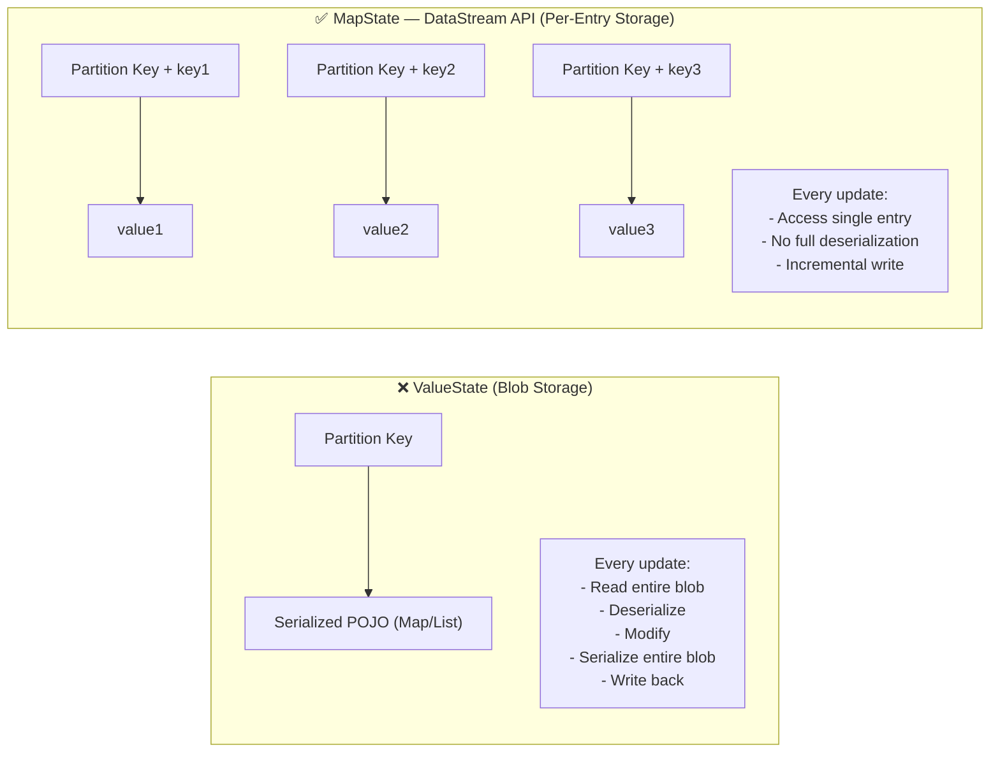

# Why `@StateHint` POJO with `Map` or `List` Are Sensitive to "Extremely Large State"

> **TL;DR:**  
> A `Map` inside `@StateHint` is not a map — it’s a **serialized blob**.  
> Every update rewrites the entire thing → performance collapse → 💥 fails at ~2GB **serialized value size**.

The issue isn’t just “large state.”

It’s **how that state is physically stored and accessed**.

**Table of Contents**
<!--toc-start-->
- [**1.0 What `@StateHint` Really Means Under the Hood**](#10-what-statehint-really-means-under-the-hood)
- [**2.0 Why This Can Become a Scaling Problem**](#20-why-this-can-become-a-scaling-problem)
    - [**2.1 Hard limit cliff at 2 GB per serialized value**](#21-hard-limit-cliff-at-2-gb-per-serialized-value)
- [**3.0 The Solution: Use `MapView` and `ListView` (When Available)**](#30-the-solution-use-mapview-and-listview-when-available)
    - [**3.1 Why Confluent's PTF Early Access doesn't support `MapView` or `ListView` yet**](#31-why-confluents-ptf-early-access-doesnt-support-mapview-or-listview-yet)
- [4.0 What Actually Happens at Runtime](#40-what-actually-happens-at-runtime)
<!-- tocstop -->

---

## **1.0 What `@StateHint` Really Means Under the Hood**

**Blob vs Per-Entry State (What’s Actually Happening)**


When you annotate a POJO with `@StateHint`, Flink backs it with a single **`ValueState<YourPojo>`** — a DataStream API keyed state primitive. That means the entire POJO — including any `Map` or `List` fields inside it — is treated as one atomic value. 

So, this:

```java
public static class MyState {
    public Map<String, Integer> myMap;
}
```

...is effectively:

```java
ValueState<Map<String, Integer>> myState;
```

**Implication**

Every access becomes:

1. Read entire POJO from [RocksDB](https://rocksdb.org/) (deserialize)
2. Modify one tiny part
3. Write entire POJO back (serialize)

Even if you only update one key in the map, you still pay the cost of the entire structure.

---

## **2.0 Why This Can Become a Scaling Problem**

Flink's keyed state primitives — `ValueState`, `MapState`, and `ListState` — are part of the **DataStream API**. These are the low-level building blocks that determine how data is physically stored in [RocksDB](https://rocksdb.org/). States that use `ListState`, a merge operation in RocksDB, can silently accumulate value sizes > 2^31 bytes and will then fail on their next retrieval.

You see in RocksDB there are two main write patterns for state:

1. Put - overwrites the entire value for a key.  This is what happens with `ValueState` and `MapState` use.  Each write replaces the previous value completely.

2. Merge - appends data to an existing key without reading-then-writing.  This is what `ListState` uses.  When you call `listState.add(newElement)`, Flink doesn't read the existing list, deserialize it, append, re-serialize, and write back.  Instead, it uses RocksDB's merge operator to just append the new element directly in RocksDB.  This is much more efficient for large lists.

But there is a problem with the `Merge` pattern when your state values get very large.  If you have a `ListState` that grows so big that its serialized form exceeds 2^31 bytes=2GB (the max size of a Java `byte[]`), then you get silent corruption.  The write appears to succeed, but the next time you read it, it crashes because the data is corrupted.

### **2.1 Hard limit cliff at 2 GB per serialized value**

RocksDB's JNI (Java Native Interface) bridge — the layer that lets Java talk to RocksDB's native C++ code — passes data back and forth as `byte[]` arrays. Java's `byte[]` has a maximum length of `2^31 - 1` bytes (just under 2GB).

So when Flink tries to serialize your entire POJO (including its map or list) into a `byte[]` to hand off to RocksDB, if the serialized result exceeds 2GB, it silently overflows. You don't get an error immediately — the write may appear to succeed. The crash happens on the **next read**, when Flink tries to deserialize the corrupted bytes back into your POJO.

That's what makes it particularly nasty — it's not a clean "your state is too big" error at write time. It's a silent corruption that blows up later, potentially after a checkpoint/restore cycle, making it hard to diagnose.

`MapState` (DataStream API) is used as a replacement for `ListState` or `ValueState` in case the records get too big for the RocksDB JNI bridge.

> 🚨 **Production Risk**
> This does NOT fail when writing state.
> It fails on the **next read** — often after checkpoint/restore.
>
> This makes it extremely difficult to diagnose in real systems.

---

## **3.0 The Solution: Use `MapView` and `ListView` (When Available)**

`MapView` and `ListView` are **Table API / SQL API** abstractions — they are facades designed for use in User-Defined Aggregate Functions (UDAFs) and Process Table Functions (PTFs). Under the hood, they delegate to Flink's **DataStream API** keyed state primitives (`MapState` and `ListState`, respectively). In RocksDB:
- Each **`MapState` entry** is stored as an independent RocksDB key (`partition_key + map_entry_key → value`). You can look up, update, or delete a single entry without touching the rest.
- Each **`ListState` entry** is similarly stored per-element.

This is exactly why `MapView` and `ListView` exist — they bridge the Table API world (where you write UDAFs and PTFs) to the efficient per-entry storage of the DataStream API's `MapState` and `ListState`. They are designed for **extremely large collections**.  You never materialize the whole thing on the JVM heap. You do surgical point lookups via JNI into RocksDB.

> **API Layer Summary:**
> | Layer | State Types | Used In |
> |---|---|---|
> | **DataStream API** | `ValueState`, `MapState`, `ListState`, `ReducingState`, `AggregatingState` | `RichFunction`, `KeyedProcessFunction`, etc. |
> | **Table API / SQL** | `MapView`, `ListView` | UDAFs, PTFs (wraps DataStream state primitives) |
> | **`@StateHint` POJO** | Maps to `ValueState` internally | PTFs (blob storage — the problem this doc describes) |

### **3.1 Why Confluent's PTF Early Access doesn't support `MapView` or `ListView` yet**

This is a tracked sub-task: [FLINK-37598 — "Support `ListView` and `MapView` in PTFs"](https://issues.apache.org/jira/browse/FLINK-37598) — filed by Timo Walther (the [FLIP-440](https://cwiki.apache.org/confluence/pages/viewpage.action?pageId=298781093) author) to add list state and map state support in PTFs. It wasn't in the original FLIP-440 scope and is a planned addition. The Confluent Early Access simply reflects the upstream Flink state: `MapView` and `ListView` in PTFs are not yet implemented in Flink itself, let alone wired through Confluent's managed platform.

---

## **4.0 What Actually Happens at Runtime**
When you use `@StateHint` with a POJO containing a `Map` or `List` field, Flink treats the **entire POJO as one single value** in storage. Every time an event arrives, Flink has to:

1. Read the whole thing from RocksDB and deserialize it into memory
2. Let your code make whatever change it needs (maybe just updating one entry)
3. Serialize the whole thing back and write it to RocksDB

So if your map has 10,000 entries and you only need to update one of them, you're still reading and writing all 10,000 entries on every single event.

`MapView` and `ListView` — Table API facades over the DataStream API's `MapState` and `ListState` — (which aren't supported in PTFs yet) would fix this by storing each map and list entry as its own independent record in RocksDB — so you only touch the one entry you actually need.

The phrase "extremely large state" in the callout on the [Confluent docs](https://docs.confluent.io/cloud/current/flink/concepts/process-table-functions.html#listview-not-supported) is basically shorthand for: *"at some point your `map` or `list` gets big enough that this full serdes cycle on every event becomes a real performance problem"* — and there's also a hard technical cliff at 2GB where the whole thing crashes.

---

## 🧠 Final Mental Model

> A `Map` inside `@StateHint` is not a data structure — it’s a **blob**.

That means:

- Every update rewrites everything  
- There are no partial updates  
- It will eventually hit a hard limit  

And when it does:

> It won’t fail immediately — it will fail later, and painfully.
