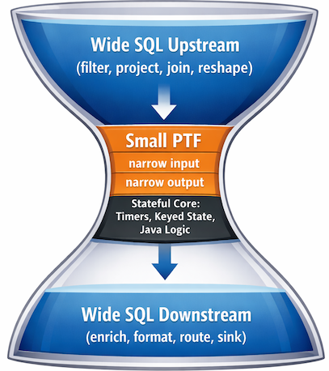

# **When to use Flink SQL `LATERAL VIEW` vs. a `ProcessTableFunction` (PTF)**

<!--toc start-->

* [**1.0 The guideline**](#10-the-guideline)
* [**2.0 A practical version of the rule**](#20-a-practical-version-of-the-rule)
* [**3.0 What "minimizing the complexity of the UDF" looks like in practice**](#30-what-minimizing-the-complexity-of-the-udf-looks-like-in-practice)

<!--toc end-->

---

## **1.0 The guideline**

**Use SQL for everything it can express. Reach for a PTF only when you need something SQL fundamentally cannot do — and when you do, make the PTF do *only that thing*.**

Why this is the right default:

1. **The optimizer sees SQL; it cannot see inside a UDF.**
   Predicate pushdown, projection pruning, join reordering, filter fusion, watermark alignment — all stop at the boundary of a Java function. Every column referenced in `eval()` must be materialized whether you use it or not.

2. **SQL is declarative and portable.**
   A `LATERAL VIEW` query runs unchanged across Flink versions, Confluent Cloud, and local test environments. A PTF is compiled Java—packaged, registered, versioned, and deployed.

3. **State and timers are where complexity lives.**
   That’s where bugs hide: TTL, key cardinality, checkpoint size, late events, timer storms. Keeping that complexity isolated in a small, well-defined PTF is exactly what you want.

4. **Schema evolution is cheaper in SQL.**
   Adding a column to an `UNNEST` chain is trivial. Adding it to a PTF means updating type hints, output construction, tests, and rebuilding the JAR.

---

## **2.0 A practical version of the rule**

Think of this as a decision ladder—stop at the first rung that works:

1. **Pure SQL**
   (projections, filters, joins, window TVFs, `MATCH_RECOGNIZE`)

2. **Flink SQL + built-in table functions**
   (`UNNEST`, `LATERAL`, `JSON_TABLE`, `STRING_SPLIT`, …)

3. **Scalar / table / aggregate UDFs**
   Small custom logic with no cross-row memory

4. **Row-semantic PTF**
   When per-row logic is too complex for a scalar UDF but still stateless
   *(In practice, this is often still better expressed in SQL.)*

5. **Set-semantic PTF (state + timers)**
   When you need keyed state, event-time timers, custom windowing, sessionization, deduplication with memory, or “emit on Nth event”
   👉 **This is where PTFs justify their existence**

---

## **3.0 What "minimizing the complexity of the UDF" looks like in practice**

When you *do* write a stateful PTF:

* **Push everything upstream into SQL.**
  Filter, project, and join *before* the PTF. Feed it the narrowest possible table. This reduces state size, checkpoint cost, and CPU.

* **Push everything downstream into SQL.**
  Emit only the minimal facts. Let SQL handle enrichment, formatting, and final shaping.

* **One PTF, one responsibility.**
  No “god PTFs.” If it sessionizes *and* dedupes *and* enriches — you’ve gone too far.

* **Keep `eval()` boring.**
  If you’re doing parsing or heavy transformations, it likely belongs in SQL or a small stateless UDF.

* **Make state explicit and named.**
  This pays off during debugging and checkpoint recovery.

* **Test in isolation.**
  A well-designed PTF has a narrow contract — table in, table out — which makes it easy to validate with a mini-cluster.

---

## 🧠 Final Mental Model

A good PTF in a SQL pipeline is shaped like an **hourglass**:

**The PTF is the pinch point.** Keep everything declarative in the wide top and bottom. The Java in the middle stays small and focused, used only where **process time/event time, keyed state, and control over when to emit, what to emit, and why** go beyond Flink SQL.

---

💡 **If your PTF is doing formatting, joining, or reshaping — you wrote it too big.**
