# Running the `Makefile` Automation

**Table of Contents**
<!-- toc -->
+ [**1.0 Local Infrastructure Deployment Made Simple with a `Makefile`**](#10-local-infrastructure-deployment-made-simple-with-a-makefile)
    - [**1.1 Install the Tooling (One Command Setup)**](#11-install-the-tooling-one-command-setup)
    - [**1.2 Full stack (CP)**](#12-full-stack-cp)
    - [**1.3 Add Apache Flink + CMF (run separately after `make cp-up`)**](#13-add-apache-flink--cmf-run-separately-after-make-cp-up)
+ [**2.0 `Makefile` Composite Workflow Target Reference**](#20-makefile-composite-workflow-target-reference)
+ [**3.0 `Makefile` Individual Target Reference**](#30-makefile-individual-target-reference)
+ [**4.0 `Makefile` Target Configuration Reference**](#40-makefile-target-configuration-reference)
+ [**5.0 Remote Server Setup (SSH Tunneling)**](#50-remote-server-setup-ssh-tunneling)
<!-- tocstop -->

---

## **1.0 Local Infrastructure Deployment Made Simple with a `Makefile`**

The included [`Makefile`](https://makefiletutorial.com/) acts as your control plane—automating setup, teardown, and day-to-day workflows—so you can focus on building Flink pipelines, not infrastructure.

**`Makefile` Architecture**

```mermaid
graph TD
    %% ── Composite entry points ──────────────────────────────────────────
    CP_UP(["`**make cp-up**`"])
    FLINK_UP(["`**make flink-up**`"])
    CP_DOWN(["`**make cp-down**`"])
    FLINK_DOWN(["`**make flink-down**`"])
    TEARDOWN(["`**make confluent-teardown**`"])
    NUKE(["`**make nuke**`"])

    %% ── Phase 1: Prerequisites ──────────────────────────────────────────
    subgraph P1["Phase 1 — Prerequisites"]
        INSTALL_PRE["install-prereqs\ndocker · kubectl · minikube\nhelm · gettext · gradle · openjdk-21"]
        CHECK_PRE["check-prereqs\ndocker · kubectl · minikube · helm · java 21"]
        UNINSTALL_PRE["uninstall-prereqs\nremove all installed tooling"]
    end

    %% ── Phase 2: Minikube ───────────────────────────────────────────────
    subgraph P2["Phase 2 — Minikube"]
        MK_START["minikube-start\ncpus=6 · mem=20GB · disk=50GB"]
        MK_STOP["minikube-stop"]
        MK_DELETE["minikube-delete"]
    end

    %% ── Phase 3: Confluent Operator ─────────────────────────────────────
    subgraph P3["Phase 3 — Confluent Operator"]
        NS["namespace\nkubectl create namespace confluent"]
        OP_INSTALL["operator-install\nhelm: confluent-for-kubernetes"]
        OP_UNINSTALL["operator-uninstall"]
    end

    %% ── Phase 4: Confluent Platform ─────────────────────────────────────
    subgraph P4["Phase 4 — Confluent Platform"]
        CP_DEPLOY["cp-deploy\nKafka KRaft · SR · Connect\nksqlDB · REST Proxy · C3"]
        CP_DELETE["cp-delete"]
    end

    %% ── Phase 5: Confluent Control Center (C3) ──────────────────────────
    subgraph P5["Phase 5 — Confluent Control Center (C3)"]
        C3["c3-open\nlocalhost:9021"]
    end

    %% ── Phase 6: Apache Flink ───────────────────────────────────────────
    subgraph P6["Phase 6 — Apache Flink"]
        CERT["flink-cert-manager\ncert-manager v1.18.2"]
        FL_OP["flink-operator-install\nhelm: confluentinc/flink-kubernetes-operator 1.130.0"]
        FL_RBAC["flink-rbac\nsupplemental Role + RoleBinding\n(services access for flink SA)"]
        FL_DEPLOY["flink-deploy\nenvsubst → FlinkDeployment CR\ncp-flink:2.1.1-cp1"]
        FL_UI["flink-ui\nlocalhost:8081"]
        FL_DELETE["flink-delete"]
        FL_OP_UN["flink-operator-uninstall"]
        CERT_UN["cert-manager-uninstall"]
    end

    %% ── Phase 7: CMF ────────────────────────────────────────────────────
    subgraph P7["Phase 7 — Confluent Manager for Apache Flink (CMF)"]
        CMF_INSTALL["cmf-install\nhelm: confluent-manager-for-apache-flink 2.1.0"]
        CMF_ENV["cmf-env-create\nPOST /cmf/api/v1/environments"]
        CMF_OPEN["cmf-open\nlocalhost:8080/cmf/api/v1/environments"]
        CMF_PROXY["cmf-proxy-inject\nsocat sidecar → C3 Flink tab"]
        CMF_UN["cmf-uninstall"]
    end

    %% ── Phase 8: Build & Deploy PTF UDFs ────────────────────────────────
    subgraph P8["Phase 8 — Build & Deploy PTF UDFs"]
        BUILD_PTF_SD["build-ptf-udf-row-driven\n./gradlew clean shadowJar\n(2 UDFs in one JAR)"]
        DEPLOY_CP_PTF_SD["deploy-cp-ptf-udf-row-driven\ncopy JAR → Flink SQL Client\n(2 row-driven pipelines)"]
        TEARDOWN_CP_PTF_SD["teardown-cp-ptf-udf-row-driven"]
        DEPLOY_CC_PTF_SD["deploy-cc-ptf-udf-row-driven\nJAR → Confluent Cloud\n(2 row-driven pipelines)"]
        TEARDOWN_CC_PTF_SD["teardown-cc-ptf-udf-row-driven"]
        PRODUCE_UE["produce-user-events-record\nkafka-console-producer → user_events"]
        PRODUCE_OR["produce-orders-record\nkafka-console-producer → orders"]
        BUILD_PTF_TD["build-ptf-udf-timer-driven\n./gradlew clean shadowJar\n(4 UDFs in one JAR)"]
        DEPLOY_CP_PTF_TD["deploy-cp-ptf-udf-timer-driven\ncopy JAR → Flink SQL Client\n(4 timer-driven pipelines)"]
        TEARDOWN_CP_PTF_TD["teardown-cp-ptf-udf-timer-driven"]
        DEPLOY_CC_PTF_TD["deploy-cc-ptf-udf-timer-driven\nJAR → Confluent Cloud\n(4 timer-driven pipelines)"]
        TEARDOWN_CC_PTF_TD["teardown-cc-ptf-udf-timer-driven"]
        PRODUCE_UA["produce-user-activity-record\nkafka-console-producer → user_activity"]
        PRODUCE_UAC["produce-user-actions-record\nkafka-console-producer → user_actions"]
        PRODUCE_SR["produce-service-requests-record\nkafka-console-producer → service_requests"]
        PRODUCE_CE["produce-cart-events-record\nkafka-console-producer → cart_events"]
    end

    %% ── Manifests / Templates ───────────────────────────────────────────
    subgraph FS["k8s/base/"]
        MANIFEST[("flink-basic-deployment.yaml\nFLINK_IMAGE · FLINK_VERSION")]
        RBAC_MANIFEST[("flink-rbac.yaml\nRole + RoleBinding")]
    end

    %% ── make cp-up dependency chain ─────────────────────────────────────
    CP_UP --> CHECK_PRE
    CP_UP --> MK_START
    CP_UP --> CP_CORE_UP

    CP_CORE_UP["cp-core-up"] --> OP_INSTALL
    CP_CORE_UP --> CP_DEPLOY
    OP_INSTALL --> NS

    %% ── make flink-up dependency chain ──────────────────────────────────
    FLINK_UP --> CERT
    FLINK_UP --> FL_OP
    FLINK_UP --> CMF_INSTALL
    FLINK_UP --> CMF_ENV
    FLINK_UP --> FL_DEPLOY
    FL_OP --> NS
    FL_DEPLOY --> FL_RBAC
    FL_DEPLOY --> MANIFEST
    FL_RBAC --> RBAC_MANIFEST

    %% ── make deploy-cp-ptf-udf-row-driven dependency chain ─────────────────────────
    DEPLOY_CP_PTF_SD --> BUILD_PTF_SD

    %% ── make deploy-cc-ptf-udf-row-driven dependency chain ─────────────────────────
    DEPLOY_CC_PTF_SD --> BUILD_PTF_SD

    %% ── make deploy-cp-ptf-udf-timer-driven dependency chain ──────────────────────────
    DEPLOY_CP_PTF_TD --> BUILD_PTF_TD

    %% ── make deploy-cc-ptf-udf-timer-driven dependency chain ──────────────────────────
    DEPLOY_CC_PTF_TD --> BUILD_PTF_TD

    %% ── make cp-down dependency chain ────────────────────────────────────
    CP_DOWN --> CP_DELETE
    CP_DOWN --> OP_UNINSTALL

    %% ── make flink-down dependency chain ─────────────────────────────────
    FLINK_DOWN --> FL_DELETE
    FLINK_DOWN --> CMF_UN
    FLINK_DOWN --> FL_OP_UN
    FLINK_DOWN --> CERT_UN

    %% ── make confluent-teardown ───────────────────────────────────────────
    TEARDOWN -->|"1 — check minikube running"| FLINK_DOWN
    TEARDOWN -->|"2"| CP_DOWN
    TEARDOWN -->|"3 — delete namespace"| NS
    TEARDOWN -->|"4"| MK_STOP

    %% ── make nuke ─────────────────────────────────────────────────────────
    NUKE -->|"1"| TEARDOWN
    NUKE -->|"2"| MK_DELETE
    NUKE -->|"3"| UNINSTALL_PRE

    %% ── UI access ────────────────────────────────────────────────────────
    CP_DEPLOY -.->|"once Running"| C3
    FL_DEPLOY -.->|"once Running"| FL_UI
    CMF_INSTALL -.->|"once Running"| CMF_OPEN
    CMF_INSTALL -.->|"C3 Flink tab"| CMF_PROXY

    %% ── Styles ───────────────────────────────────────────────────────────
    classDef entry    fill:#1a1a2e,stroke:#e94560,color:#fff,font-weight:bold
    classDef install  fill:#16213e,stroke:#0f3460,color:#a8dadc
    classDef remove   fill:#2d1b1b,stroke:#8b0000,color:#ffb3b3
    classDef ui       fill:#1b2d1b,stroke:#2d6a2d,color:#b3ffb3
    classDef file     fill:#2d2b1b,stroke:#8b7500,color:#ffe680
    classDef composite fill:#2a1a2e,stroke:#9b59b6,color:#dbb8ff

    class CP_UP,FLINK_UP,CP_DOWN,FLINK_DOWN,TEARDOWN,NUKE entry
    class CP_CORE_UP,DEPLOY_CP_PTF_SD,DEPLOY_CC_PTF_SD,DEPLOY_CP_PTF_TD,DEPLOY_CC_PTF_TD composite
    class INSTALL_PRE,CHECK_PRE,MK_START,NS,OP_INSTALL,CP_DEPLOY,CERT,FL_OP,FL_RBAC,FL_DEPLOY,CMF_INSTALL,CMF_ENV,CMF_PROXY,BUILD_PTF_SD,BUILD_PTF_TD,PRODUCE_UE,PRODUCE_OR,PRODUCE_UA,PRODUCE_UAC,PRODUCE_SR,PRODUCE_CE install
    class MK_STOP,MK_DELETE,OP_UNINSTALL,CP_DELETE,FL_DELETE,FL_OP_UN,CERT_UN,CMF_UN,UNINSTALL_PRE,TEARDOWN_CP_PTF_SD,TEARDOWN_CC_PTF_SD,TEARDOWN_CP_PTF_TD,TEARDOWN_CC_PTF_TD remove
    class C3,FL_UI,CMF_OPEN ui
    class MANIFEST,RBAC_MANIFEST file
```


---

### **1.1 Install the Tooling (One Command Setup)**
Get everything you need to deploy the full stack locally with a single command:

```bash
make install-prereqs
```

This installs `docker`, `kubernetes-cli`, `minikube`, `helm`, `gettext`, `gradle`, and `openjdk-21`, via Homebrew (macOS) or apt-get (Linux). Once complete, **launch Docker Desktop** before proceeding.

---

### **1.2 Full stack (CP)**

```bash
make cp-up
```

This runs: `check-prereqs` → `minikube-start` → `namespace` → `operator-install` → `cp-deploy`.

Run `make cp-watch` to watch for pods coming up in the confluent namespace and ensure they are running before proceeding (Ctrl+C to exit).

Once pods are up, open Confluent Control Center (C3):

```bash
make c3-open        # http://localhost:9021
```

### **1.3 Add Apache Flink + CMF (run separately after `make cp-up`)**

```bash
make flink-up
```

This runs: `flink-cert-manager` → `flink-operator-install` → `cmf-install` → `cmf-env-create` → `flink-deploy`. `flink-up` is self-contained and can also be run standalone on a fresh cluster.

Once the Flink JobManager pod is running:

```bash
make flink-ui       # http://localhost:8081 (background — returns prompt)
make flink-ui-stop  # stop the background port-forward
make cmf-open       # http://localhost:8080/cmf/api/v1/environments
```

To expose the Flink tab inside Control Center, inject the CMF proxy sidecar:

```bash
make cmf-proxy-inject
```

---

## **2.0 `Makefile` Composite Workflow Target Reference**

| Target | What it does |
|--------|-------------|
| `make cp-up` | Full stack: Minikube + CP |
| `make flink-up` | cert-manager + Confluent Flink Operator + CMF + Flink cluster |
| `make cp-down` | Remove CP and Operator (Minikube keeps running) |
| `make flink-down` | Remove Flink cluster, CMF, Operator, and cert-manager |
| `make confluent-teardown` | Full teardown: everything + stop Minikube |
| `make nuke` | Full wipe: confluent-teardown + minikube-delete + uninstall-prereqs (leaves machine as close to factory as possible) |

---

## **3.0 `Makefile` Individual Target Reference**

<details>
<summary>Phase 1 — Prerequisites</summary>
    
| Target | Description |
|--------|-------------|
| `install-prereqs` | Install Docker Desktop, kubectl, Minikube, Helm, envsubst, and Gradle via Homebrew |
| `check-prereqs` | Verify all required tools are available |
| `uninstall-prereqs` | Uninstall all prerequisites installed by `install-prereqs` (safe to run even if not installed) |

</details>

<details>
<summary>Phase 2 — Minikube</summary>

| Target | Description |
|--------|-------------|
| `minikube-start` | Start Minikube with configured resources |
| `minikube-status` | Show Minikube and node status |
| `minikube-stop` | Stop the Minikube cluster |
| `minikube-delete` | Permanently delete the Minikube cluster |
</details>

<details>
<summary>Phase 3 — Confluent Operator</summary>

| Target | Description |
|--------|-------------|
| `namespace` | Create the `confluent` namespace and set it as default context |
| `operator-install` | Add Confluent Helm repo and install CFK Operator |
| `operator-status` | Show CFK Operator pod status |
| `operator-uninstall` | Remove the CFK Operator Helm release |
</details>

<details>
<summary>Phase 4 — Confluent Platform</summary>

| Target | Description |
|--------|-------------|
| `cp-deploy` | Deploy Kafka (KRaft), Schema Registry, Connect, ksqlDB, REST Proxy, Control Center |
| `cp-watch` | Watch pod startup live (Ctrl+C to exit) |
| `cp-status` | Show current pod status |
| `cp-delete` | Remove all CP components and leftover PVCs |
</details>

<details>
<summary>Phase 5 — Control Center</summary>

| Target | Description |
|--------|-------------|
| `c3-open` | Port-forward Control Center in the background and open `http://localhost:9021` (`make c3-stop` to kill) |
| `c3-stop` | Stop the background Control Center port-forward |
</details>

<details>
<summary>Phase 6 — Apache Flink</summary>

| Target | Description |
|--------|-------------|
| `flink-cert-manager` | Install cert-manager (Confluent Flink Operator dependency) |
| `flink-operator-install` | Install the Confluent Flink Kubernetes Operator (`confluentinc/flink-kubernetes-operator`) |
| `flink-operator-status` | Show Flink Operator pod status |
| `flink-operator-uninstall` | Remove the Confluent Flink Operator Helm release |
| `flink-rbac` | Apply supplemental RBAC so the `flink` SA can read services (needed for job submission) |
| `flink-deploy` | Deploy the Flink session cluster using `FLINK_MANIFEST` (runs `flink-rbac` first) |
| `flink-status` | Show Flink pods and FlinkDeployment CRs |
| `flink-ui` | Port-forward Flink UI in the background and open `http://localhost:8081` (`make flink-ui-stop` to kill) |
| `flink-ui-stop` | Stop the background Flink UI port-forward |
| `flink-delete` | Delete the Flink session cluster |
| `cert-manager-uninstall` | Remove cert-manager |
</details>

<details>
<summary>Phase 7 — Confluent Manager for Apache Flink (CMF)</summary>

| Target | Description |
|--------|-------------|
| `cmf-install` | Install CMF via Helm (`confluent-manager-for-apache-flink`) and wait for pod readiness |
| `cmf-env-create` | Create a Flink environment (`CMF_ENV_NAME`) in CMF pointing to the `confluent` namespace |
| `cmf-status` | Show CMF pod status and list registered Flink environments |
| `cmf-open` | Port-forward CMF REST API and open `http://localhost:8080/cmf/api/v1/environments` |
| `cmf-uninstall` | Uninstall CMF (safe to run even if not installed) |
| `cmf-proxy-inject` | Patch the C3 StatefulSet with a `socat` sidecar to expose the Flink tab in Control Center |
| `cmf-proxy-remove` | Remove the CMF proxy sidecar and resume CFK reconciliation |
| `cmf-proxy-logs` | Stream logs from the `cmf-proxy` sidecar in the C3 pod |
</details>

<details>
<summary>Phase 8 — Build & Deploy Flink JARs</summary>

| Target | Description |
|--------|-------------|
| `build-ptf-udf-row-driven` | Build the `row-driven` PTF UDF uber JAR (requires Gradle) |
| `deploy-cp-ptf-udf-row-driven` | Build `row-driven` UDF JAR, copy to Flink pods, and submit SQL via Flink SQL Client |
| `teardown-cp-ptf-udf-row-driven` | Tear down the `row-driven` PTF UDF deployment |
| `deploy-cc-ptf-udf-row-driven` | Build and deploy the `row-driven` UDF JAR to Confluent Cloud via Terraform |
| `teardown-cc-ptf-udf-row-driven` | Tear down the `row-driven` PTF UDF deployment from Confluent Cloud |
| `build-ptf-udf-timer-driven` | Build the `timer-driven` PTF UDF uber JAR (requires Gradle) |
| `deploy-cp-ptf-udf-timer-driven` | Build `timer-driven` UDF JAR, copy to Flink pods, and submit SQL via Flink SQL Client |
| `teardown-cp-ptf-udf-timer-driven` | Tear down the `timer-driven` PTF UDF deployment |
| `deploy-cc-ptf-udf-timer-driven` | Build and deploy the `timer-driven` UDF JAR to Confluent Cloud via Terraform |
| `teardown-cc-ptf-udf-timer-driven` | Tear down the `timer-driven` PTF UDF deployment from Confluent Cloud |
</details>

---

## **4.0 `Makefile` Target Configuration Reference**

All variables are overridable at the command line.

<details>
<summary>Defaults</summary>

| Variable | Default | Description |
|----------|---------|-------------|
| `NAMESPACE` | `confluent` | Kubernetes namespace |
| `CONFLUENT_MANIFEST` | `k8s/base/confluent-platform-c3++.yaml` | Path to Confluent Platform manifest |
| `MINIKUBE_CPUS` | `6` | vCPUs allocated to Minikube |
| `MINIKUBE_MEM` | `20480` | Memory in MB |
| `MINIKUBE_DISK` | `50g` | Disk size |
| `FLINK_OPERATOR_VER` | `1.130.0` | Confluent Flink Kubernetes Operator version |
| `FLINK_IMAGE` | `confluentinc/cp-flink:2.1.1-cp1-java21` (auto-selects `-arm64` suffix on arm64 nodes) | Flink container image |
| `FLINK_VERSION` | `v2_1` | Flink API version string for the FlinkDeployment CR |
| `FLINK_CLUSTER_NAME` | `flink-basic` | Name of the FlinkDeployment resource |
| `FLINK_MANIFEST` | `k8s/base/flink-basic-deployment.yaml` | Path to FlinkDeployment template |
| `FLINK_RBAC_MANIFEST` | `k8s/base/flink-rbac.yaml` | Path to supplemental RBAC manifest for the `flink` ServiceAccount |
| `CERT_MANAGER_VER` | `v1.18.2` | cert-manager version |
| `CMF_VER` | `2.1.0` | Confluent Manager for Apache Flink version |
| `CMF_PORT` | `8080` | CMF REST API local port |
| `CMF_ENV_NAME` | `dev-local` | Flink environment name registered in CMF |
| `C3_PORT` | `9021` | Control Center local port |
| `FLINK_UI_PORT` | `8081` | Flink UI local port |
| `PTF_UDF_TOPICS` | `user_events enriched_events` | Kafka topics for the ptf_udf Flink job |
</details>

> **Note:** CMF uses the Confluent-packaged Flink operator (`confluentinc/flink-kubernetes-operator`) and `confluentinc/cp-flink` images — not the Apache OSS Flink operator or `flink` Docker Hub image.

Example — deploy a specific Flink image:

```bash
make flink-deploy FLINK_IMAGE=confluentinc/cp-flink:2.1.1-cp1-java21-arm64 FLINK_VERSION=v2_1
```
