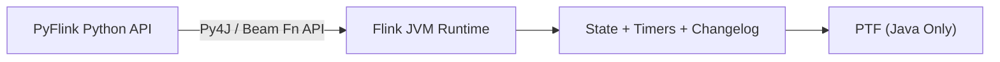

# Why is there no Community or Confluent Python support for PTF UDFs?
**Process Table Functions (PTFs) are currently JVM-only in Flink 2.1+ because the Python API lacks the runtime bindings required to support stateful, timer-driven table semantics.**
This is not a simple API gap—it reflects a deeper architectural limitation in PyFlink’s execution model, which cannot provide the tight JVM integration required for native state access, timer services, and changelog-aware processing.

> **Note:** PTF support in PyFlink would require end-to-end runtime bindings (Py4J, proxy classes, state/timer abstractions) across the Python–JVM boundary—a non-trivial effort given their deep integration with Flink’s native runtime.

In practice, this means any workload requiring advanced table-level state and timers must be implemented in Java, even in otherwise Python-based pipelines.

PTFs sit at the boundary of Flink’s most advanced Table API capabilities, which are deeply tied to the JVM execution model.

**Architecture Overview (Python ↔ JVM Boundary)**


**Table of Contents**
<!-- toc -->
- [**1.0 What to know about PyFlink UDF Support**](#10-what-to-know-about-pyflink-udf-support)
    + [**1.1 What are the different use cases for each UDF type**](#11-what-are-the-different-use-cases-for-each-udf-type)
        - [**1.1.1 Scalar Functions (UDF)**](#111-scalar-functions-udf)
        - [**1.1.2 Table Functions (UDTF)**](#112-table-functions-udtf)
        - [**1.1.3 Aggregate Functions (UDAF)**](#113-aggregate-functions-udaf)
        - [**1.1.4 Table Aggregate Functions (UDTAGF)**](#114-table-aggregate-functions-udtagf)
        - [**1.1.5 Process Table Functions (PTF)**](#115-process-table-functions-ptf)
            + [**1.1.5.1 How it differs from a regular Table Function (UDTF)**](#1151-how-it-differs-from-a-regular-table-function-udtf)
            + [**1.1.5.2 Example from this repo**](#1152-example-from-this-repo)
- [**2.0 Why PTFs Are Hard to Bring to Python**](#20-why-ptfs-are-hard-to-bring-to-python)
- [**3.0 Claude Recommended Practical Workarounds**](#30-claude-recommended-practical-workarounds)
    + [**3.1 ─ Option 1: Write the PTF in Java, call Python logic via subprocess/gRPC**](#31-─-option-1-write-the-ptf-in-java-call-python-logic-via-subprocessgrpc)
    + [**3.2 ─ Option 2: Register a Java PTF from a PyFlink job**](#32-─-option-2-register-a-java-ptf-from-a-pyflink-job)
    + [**3.3 ─ Option 3: Approximate with PyFlink DataStream API**](#33-─-option-3-approximate-with-pyflink-datastream-api)
    + [**3.4 ─ Option 4: Wait for Confluent Cloud Python UDF GA (if on Confluent)**](#34-─-option-4-wait-for-confluent-cloud-python-udf-ga-if-on-confluent)
<!-- tocstop -->
---

## **1.0 What to know about PyFlink UDF Support**

Below is a table of the PyFlink UDF types and their support status:

| UDF Type | PyFlink Support |
|---|---|
| Scalar Function (`ScalarFunction`) | ✅ |
| Table Function (`TableFunction` / UDTF) | ✅ |
| Aggregate Function (UDAF) | ✅ |
| Table Aggregate Function (UDTAGF) | ✅ |
| **Process Table Function (PTF)** | ❌ **Not supported** |

### **1.1 What are the different use cases for each UDF type**

#### **1.1.1 Scalar Functions (UDF)**
- Row-by-row transformations (e.g., parsing, formatting, string manipulation)
- Custom business logic calculations
- Data type conversions and enrichment
- Calling external services per row (with caching)

#### **1.1.2 Table Functions (UDTF)**
- Splitting a single row into multiple rows (e.g., exploding a JSON array)
- Unnesting complex/nested data structures
- Generating rows from a single input value (e.g., date range expansion)

#### **1.1.3 Aggregate Functions (UDAF)**
- Custom aggregations beyond built-in SUM/AVG/COUNT (e.g., weighted averages, percentiles)
- Stateful accumulations over grouped data
- Complex metrics like HyperLogLog distinct counts

#### **1.1.4 Table Aggregate Functions (UDTAGF)**
- Returning multiple rows from an aggregation (e.g., top-N per group)
- Multi-row statistical summaries

#### **1.1.5 Process Table Functions (PTF)**
- **Stateful or timer-driven dynamic schema transformations** — reshape, pivot, or project tables where the output schema is determined at plan time rather than defined statically (e.g., a generic CSV parser that infers columns from a header row)
- **Generic data connectors** — a single function that can read from different sources and return different schemas depending on parameters
- **Row-to-table expansion with variable structure** — exploding nested/semi-structured data (JSON, Avro) where the fields vary per input
- **Reusable data processing operators** — building generic, parameterizable operators (e.g., a deduplication function, a top-N function) that work across different table shapes
- **Schema inference at plan time** — the PTF analyzes its arguments during planning and declares what columns it will produce, allowing Flink's optimizer to work with the result

##### **1.1.5.1 How it differs from a regular Table Function (UDTF)**
| | Table Function (UDTF) | PTF |
|---|---|---|
| Output schema | Fixed at definition time | Dynamic, determined at plan time |
| Input | Scalar values | Can accept entire tables + descriptors |
| Flexibility | One shape of output | Output adapts to input |

##### **1.1.5.2 Example from this repo**
The [`UserEventEnricher.java`](../examples/ptf_udf/java/app/src/main/java/ptf/UserEventEnricher.java) is a PTF that takes a `user_events` table and enriches it, producing a dynamically defined output row:

```sql
ROW<event_type STRING, payload STRING, session_id BIGINT, event_count BIGINT, last_event STRING>
```
---

## **2.0 Why PTFs Are Hard to Bring to Python**

PTF capability requirements make supporting them in Python architecturally difficult for four main reasons:

1. **Direct state access** — PTFs need native access to `ValueState`, `ListState`, etc. via `@StateHint`. PyFlink's state bridge (via gRPC/Beam Fn API) adds latency and complexity that's incompatible with PTF's per-row processing model.
2. **Timer services** — PTFs can register event-time and processing-time timers, which requires tight JVM integration not currently exposed to Python workers.
3. **Changelog access** — PTFs can observe the full `ChangelogMode` of their input, again a JVM-layer concern.
4. **Row vs. Set semantics** — the `@ArgumentHint(TABLE_AS_SET)` / `@ArgumentHint(TABLE_AS_ROW)` partitioning model has no PyFlink equivalent.

---

## **3.0 What should you do today if you need PTFs in Python**

In practice, this means implementing PTF logic in Java and invoking it from Python when needed, or approximating the behavior using PyFlink’s DataStream API.

- **Java PTF + Python integration** — Use Java for the PTF and call Python logic via subprocess, REST, or gRPC for ML/AI use cases.
- **PyFlink DataStream API** — Use `KeyedProcessFunction` to achieve similar stateful, timer-driven behavior outside the Table API.
