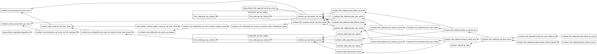

# Confluent Cloud Terraform Deployment ─ Session Timeout Detector PTF UDF (early access example)

> This example deploys the **Session Timeout Detector** PTF UDF (source in [examples/ptf_udf_timer_driven/java/](../java/)) to **Confluent Cloud** using Terraform. All infrastructure (environment, Kafka cluster, Flink compute pool, service accounts, API keys) and Flink SQL statements are declared as Terraform resources.

**Table of Contents**
<!-- toc -->
+ [**1.0 Overview**](#10-overview)
    + [**1.1 How this differs from the other deployment paths**](#11-how-this-differs-from-the-other-deployment-paths)
+ [**2.0 How it works**](#20-how-it-works)
    + [**2.1 Infrastructure provisioning**](#21-infrastructure-provisioning)
    + [**2.2 JAR delivery**](#22-jar-delivery)
    + [**2.3 Statement flow**](#23-statement-flow)
+ [**3.0 Prerequisites**](#30-prerequisites)
+ [**4.0 How to run**](#40-how-to-run)
    + [**4.1 Deploy**](#41-deploy)
    + [**4.2 Monitor**](#42-monitor)
    + [**4.3 Tear down**](#43-tear-down)
+ [**5.0 Troubleshooting**](#50-troubleshooting)
+ [**6.0 Resources**](#60-resources)
<!-- tocstop -->

## **1.0 Overview**

### **1.1 How this differs from the other deployment paths**

| Aspect | **Confluent Cloud Terraform** (this example) | Confluent Platform SQL Client |
|---|---|---|
| Where it runs | Confluent Cloud | Confluent Platform + Minikube |
| How SQL is submitted | `confluent_flink_statement` Terraform resources | `sql-client.sh -f` on the JobManager pod |
| UDF JAR delivery | `confluent_flink_artifact` (uploaded to CC) | `kubectl exec` to Flink pods |
| Entry point | `make deploy-cc-ptf-udf-timer-driven` | `make deploy-cp-ptf-udf-timer-driven` |
| Requires code compilation | ✅  (Java + Gradle for UDF JAR) | ✅  (Java + Gradle for UDF JAR) |
| Statement lifecycle | Managed by Terraform state | Managed by Flink session cluster |
| Same codebase for both? | ✅ (**same Java UDF code**, different Terraform vs SQL Client for deployment) | ✅ (**same Java UDF code**, different Terraform vs SQL Client for deployment) |

---

## **2.0 How it works**

### **2.1 Infrastructure provisioning**

Terraform declares the full Confluent Cloud stack:

| Resource | Purpose |
|---|---|
| `confluent_environment` | Isolated CC environment (`ptf-udf-timer-driven`) |
| `confluent_kafka_cluster` | Standard single-zone Kafka cluster (AWS us-east-1) |
| `confluent_schema_registry_cluster` | Stream Governance Essentials (auto-provisioned with environment) |
| `confluent_service_account` | `ptf-udf-timer-driven` service account with FlinkDeveloper, ResourceOwner, and Assigner roles |
| `confluent_flink_compute_pool` | Flink compute pool (max 10 CFU) |
| `confluent_api_key` | Flink-specific API key for statement submission |
| `flink_api_key_rotation` module | Rotating API key pair for the Flink service account |

### **2.2 JAR delivery**

On Confluent Cloud, UDF JARs are uploaded as **Flink artifacts** via the `confluent_flink_artifact` resource. The JAR is built from [examples/ptf_udf_timer_driven/java/](../java/) and uploaded directly from the local build output. The `CREATE FUNCTION ... USING JAR` statement references the artifact using a `confluent-artifact://` URI.

### **2.3 Statement flow**

Terraform manages the SQL statements as `confluent_flink_statement` resources with explicit `depends_on` ordering:

```
┌──────────────────────────────────────────────────────────────────────┐
│  Step 1:  DROP TABLE IF EXISTS user_activity            → OK         │
│  Step 2:  CREATE TABLE user_activity (...)              → OK         │
│           (includes event_time with watermark)                       │
│  Step 3:  INSERT INTO user_activity VALUES (sample data) → submitted │
│  Step 4:  DROP TABLE IF EXISTS timeout_events           → OK         │
│  Step 5:  CREATE TABLE timeout_events (...)             → OK         │
│  Step 6:  Upload UDF JAR as confluent_flink_artifact    → OK         │
│  Step 7:  CREATE FUNCTION session_timeout_detector      → OK         │
│           USING JAR 'confluent-artifact://...'                       │
│  Step 8:  INSERT INTO timeout_events                    → submitted  │
│           SELECT ... FROM TABLE(session_timeout_detector())          │
└──────────────────────────────────────────────────────────────────────┘
```

Step 8 is a **long-running streaming job**. It runs continuously, reading from `user_activity` and writing timeout detection output to `timeout_events`.

Once deployment completes, Terraform generates a visual **resource graph** at `examples/ptf_udf_timer_driven/cc_deploy/terraform.png`, providing an at-a-glance view of the infrastructure and resource dependencies: 


---

## **3.0 Prerequisites**

- macOS with Homebrew or Linux with apt-get
- Java 17+
- Terraform installed
- A Confluent Cloud account with a **Cloud API key** and **secret** ([create one here](https://confluent.cloud/settings/api-keys))
- The UDF JAR must be built before deploying:

```bash
make build-ptf-udf-timer-driven     # builds the UDF fat JAR from examples/ptf_udf_timer_driven/java/
```

---

## **4.0 How to run**

All commands are run from the **project root** (where the `Makefile` lives).

### **4.1 Deploy**

A single target builds the UDF JAR and runs `terraform apply`:

```bash
make deploy-cc-ptf-udf-timer-driven CONFLUENT_API_KEY=<your-key> CONFLUENT_API_SECRET=<your-secret>
```

Behind the scenes this runs:

| Step | What it does |
|---|---|
| 1 | `./gradlew clean shadowJar` ─ builds the UDF fat JAR from `examples/ptf_udf_timer_driven/java/` |
| 2 | `terraform init` ─ initializes the Terraform working directory |
| 3 | `terraform apply -auto-approve` ─ provisions all CC infrastructure and submits Flink SQL statements |
| 4 | Generates a Terraform visualization at `examples/ptf_udf_timer_driven/cc_deploy/terraform.png` |

### **4.2 Monitor**

Monitor the running Flink statements in the Confluent Cloud Console:

1. Navigate to your **ptf-udf-timer-driven** environment
2. Open the **Flink** tab to see compute pools and running statements
3. Open the **Topics** tab to inspect `user_activity` and `timeout_events`

### **4.3 Tear down**

To destroy all Confluent Cloud resources created by Terraform:

```bash
make teardown-cc-ptf-udf-timer-driven CONFLUENT_API_KEY=<your-key> CONFLUENT_API_SECRET=<your-secret>
```

This runs `terraform destroy -auto-approve`, removing all Flink statements, the compute pool, Kafka cluster, service accounts, and the environment.

---

## **5.0 Troubleshooting**

If you encounter an error during `make deploy-cc-ptf-udf-timer-driven` that looks like the following, it is because your organization does not have early access to timer services for PTF UDFs. Please contact your Confluent Account Executive to request access:

```
│ Error: error waiting for Flink Statement "tf-2026-04-02-100522-54a7b07c-4a42-4d53-90e0-034cb2ae1ea4" to provision: Flink Statement "tf-2026-04-02-100522-54a7b07c-4a42-4d53-90e0-034cb2ae1ea4" provisioning status is "FAILED": Method 'onTimer' of function class 'ptf.SessionTimeoutDetector' - Timer service is not supported for PTFs.; could not parse error details; raw response body: "{\"api_version\":\"sql/v1\",\"environment_id\":\"env-m60dnq\",\"kind\":\"Statement\",\"metadata\":{\"created_at\":\"2026-04-02T14:05:22.440172Z\",\"labels\":{},\"resource_version\":\"5\",\"self\":\"https://flink.us-east-1.aws.confluent.cloud/sql/v1/organizations/bd545cc3-8e7c-4387-b6d8-b6d1497a9df7/environments/env-m60dnq/statements/tf-2026-04-02-100522-54a7b07c-4a42-4d53-90e0-034cb2ae1ea4\",\"uid\":\"eff86f2f-bb53-474d-87bd-3300ead6db9f\",\"updated_at\":\"2026-04-02T14:05:22.64651Z\"},\"name\":\"tf-2026-04-02-100522-54a7b07c-4a42-4d53-90e0-034cb2ae1ea4\",\"organization_id\":\"bd545cc3-8e7c-4387-b6d8-b6d1497a9df7\",\"spec\":{\"compute_pool_id\":\"lfcp-nnpz1v\",\"execution_mode\":\"STREAMING\",\"principal\":\"sa-nvj798k\",\"properties\":{\"sql.current-catalog\":\"ptf-udf-timer-driven\",\"sql.current-database\":\"ptf-udf-timer-driven\"},\"statement\":\"CREATE FUNCTION IF NOT EXISTS session_timeout_detector\\n  AS 'ptf.SessionTimeoutDetector'\\n  USING JAR 'confluent-artifact://cfa-q57pk2';\\n\",\"stopped\":false},\"status\":{\"detail\":\"\",\"network_kind\":\"PUBLIC\",\"phase\":\"PENDING\",\"traits\":{\"connection_refs\":[],\"is_append_only\":true,\"is_bounded\":true,\"schema\":{},\"sql_kind\":\"CREATE_FUNCTION\",\"upsert_columns\":null},\"warnings\":[]}}"
│ 
│   with confluent_flink_statement.create_session_timeout_detector,
│   on setup-confluent-flink.tf line 340, in resource "confluent_flink_statement" "create_session_timeout_detector":
│  340: resource "confluent_flink_statement" "create_session_timeout_detector" {
```

---

## **6.0 Resources**

- [Confluent Terraform Provider](https://registry.terraform.io/providers/confluentinc/confluent/latest/docs)
- [confluent_flink_statement Resource](https://registry.terraform.io/providers/confluentinc/confluent/latest/docs/resources/confluent_flink_statement)
- [confluent_flink_artifact Resource](https://registry.terraform.io/providers/confluentinc/confluent/latest/docs/resources/confluent_flink_artifact)
- [Process Table Functions (PTFs)](https://nightlies.apache.org/flink/flink-docs-master/docs/dev/table/functions/ptfs/)
- [Create a User-Defined Function with Confluent Cloud for Apache Flink](https://docs.confluent.io/cloud/current/flink/how-to-guides/create-udf.html)
