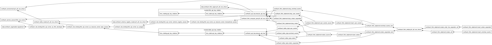

# Confluent Cloud Terraform Deployment ─ Scalar UDFs

> This example deploys **two scalar UDFs** ─ **`celsius_to_fahrenheit`** (converts Celsius to Fahrenheit) and **`fahrenheit_to_celsius`** (converts Fahrenheit to Celsius) ─ to **Confluent Cloud** using Terraform. The same two UDFs are provided in **two parallel implementations**: a **Java** path (uber JAR built from [examples/scalar_udf/java/](../java/)) and a **Python / PyFlink** path (sdist built from [examples/scalar_udf/python_cc/](../python_cc/), a CC-specific package pinned to `apache-flink==2.0.0`). Both paths share the same CC environment, Kafka cluster, Flink compute pool, service account, and source topics; only the sink topics, UDF names, and artifact format differ. All four streaming Flink statements (Java × 2, Python × 2) run side-by-side in the same compute pool, declared as `confluent_flink_statement` resources.
>
> ⚠️ **Confluent Cloud Python UDFs are an [Early Access](https://docs.confluent.io/cloud/current/flink/how-to-guides/create-udf.html) feature.** Your Confluent Cloud organization must have Python UDFs enabled for the Python path of this example to succeed. The Java path works on every CC org regardless.

**Table of Contents**
<!-- toc -->
+ [**1.0 Overview**](#10-overview)
    + [**1.1 How this differs from the other deployment paths**](#11-how-this-differs-from-the-other-deployment-paths)
+ [**2.0 How it works**](#20-how-it-works)
    + [**2.1 Infrastructure provisioning**](#21-infrastructure-provisioning)
    + [**2.2 Artifact delivery**](#22-artifact-delivery)
        + [**2.2.1 Java ─ uber JAR via `confluent_flink_artifact`**](#221-java--uber-jar-via-confluent_flink_artifact)
        + [**2.2.2 Python ─ sdist-in-ZIP via `confluent_flink_artifact`**](#222-python--sdist-in-zip-via-confluent_flink_artifact)
    + [**2.3 Statement flow**](#23-statement-flow)
+ [**3.0 Python UDF Early Access**](#30-python-udf-early-access)
+ [**4.0 Prerequisites**](#40-prerequisites)
+ [**5.0 How to run**](#50-how-to-run)
    + [**5.1 Deploy**](#51-deploy)
    + [**5.2 Monitor**](#52-monitor)
    + [**5.3 Tear down**](#53-tear-down)
+ [**6.0 Resources**](#60-resources)
<!-- tocstop -->

## **1.0 Overview**

### **1.1 How this differs from the other deployment paths**

| Aspect | **CC ─ Java** (this example) | **CC ─ Python** (this example) | CP ─ Java | CP ─ Python |
|---|---|---|---|---|
| Where it runs | Confluent Cloud | Confluent Cloud | CP on Minikube | CP on Minikube |
| How SQL is submitted | `confluent_flink_statement` Terraform resources | `confluent_flink_statement` Terraform resources | `sql-client.sh -f` on the JobManager pod | `sql-client.sh -f` on the JobManager pod |
| UDF delivery | `confluent_flink_artifact` (JAR) uploaded to CC | `confluent_flink_artifact` (ZIP wrapping an sdist tarball) uploaded to CC | `kubectl exec` copies uber JAR onto Flink pods | Custom `cp-flink-python` image with venv + `.py` files baked in |
| Language / runtime | Java 21 | Python 3.11 + `apache-flink==2.0.0` (CC's pinned runtime) | Java 21 | Python 3.11 + `apache-flink==2.1.1` (matched to CP image) |
| Entry point | `make deploy-cc-scalar-udf` (builds both JAR + ZIP, terraform apply) | `make deploy-cc-scalar-udf` (builds both JAR + ZIP, terraform apply) | `make deploy-cp-scalar-udf` | `make deploy-cp-scalar-udf-python` |
| Requires code build | ✅ Java + Gradle (UDF JAR) | ✅ `uv build --sdist` + `zip` (UDF ZIP) | ✅ Java + Gradle (UDF JAR) | ✅ Docker build of `cp-flink-python` image |
| Statement lifecycle | Managed by Terraform state | Managed by Terraform state | Managed by Flink session cluster | Managed by Flink session cluster |
| `CREATE FUNCTION` shape | `USING JAR 'confluent-artifact://…'` | `LANGUAGE PYTHON USING JAR 'confluent-artifact://…'` | `USING JAR 'file:///…/scalar-udf.jar'` | `LANGUAGE PYTHON` (no `USING JAR`; files come from `python.files` SET) |
| Feature status | GA | [Early Access](#30-python-udf-early-access) | GA | GA |

---

## **2.0 How it works**

### **2.1 Infrastructure provisioning**

Terraform declares the full Confluent Cloud stack:

| Resource | Purpose |
|---|---|
| `confluent_environment` | Isolated CC environment (`scalar-udf`) with Stream Governance Essentials |
| `confluent_kafka_cluster` | Standard single-zone Kafka cluster (AWS us-east-1) |
| `confluent_schema_registry_cluster` (data source) | Stream Governance Essentials (auto-provisioned with environment) |
| `confluent_service_account` | Service account with FlinkDeveloper, ResourceOwner (topic, transactional-id, schema-registry subject), and Assigner roles |
| `confluent_kafka_topic` × 6 | `celsius_reading`, `fahrenheit_reading` (shared sources); `celsius_to_fahrenheit`, `fahrenheit_to_celsius` (Java sinks); `celsius_to_fahrenheit_py`, `fahrenheit_to_celsius_py` (Python sinks) |
| `confluent_flink_compute_pool` | Flink compute pool (max 10 CFU) runs all four streaming statements side-by-side |
| `kafka_api_key_rotation` module | Rotating API key pair for the Kafka service account |
| `flink_api_key_rotation` module | Rotating API key pair for the Flink service account |
| `confluent_flink_artifact` × 2 | One JAR (`runtime_language = "Java"`, `content_format = "JAR"`) and one ZIP (`runtime_language = "Python"`, `content_format = "ZIP"`) |

### **2.2 Artifact delivery**

On Confluent Cloud, UDF code is uploaded as **Flink artifacts** via `confluent_flink_artifact`; each `CREATE FUNCTION … USING JAR` statement references the artifact using a `confluent-artifact://<artifact-id>` URI. The two language paths use different artifact formats.

#### **2.2.1 Java ─ uber JAR via `confluent_flink_artifact`**

Built from [examples/scalar_udf/java/](../java/) via `./gradlew clean shadowJar` and uploaded directly from `app/build/libs/app-1.0.0-SNAPSHOT.jar`. Both Java `CREATE FUNCTION` statements (`celsius_to_fahrenheit` and `fahrenheit_to_celsius`) reference the **same** artifact ID ─ both classes are bundled in the uber JAR, so a single `confluent_flink_artifact` feeds both.

#### **2.2.2 Python ─ sdist-in-ZIP via `confluent_flink_artifact`**

Confluent Cloud's Python UDF runtime expects a **source distribution (`.tar.gz`) wrapped in a `.zip`**, with `runtime_language = "Python"` and `content_format = "ZIP"` on the `confluent_flink_artifact` resource. The ZIP is built from a thin CC-only wrapper, [examples/scalar_udf/python_cc/](../python_cc/):

1. **Separate pyproject** ─ `python_cc/pyproject.toml` (project name `scalar-udf-cc`) pins `apache-flink==2.0.0` (the exact version CC's Python worker runtime currently supports), independent of the main [examples/scalar_udf/python/](../python/) project (name `scalar-udf-python`) which pins `apache-flink==2.1.1` to match the Confluent Platform session cluster. This isolation is deliberate: the two runtimes ship different Flink Python wheels that cannot be satisfied by a single lock.
2. **Single source of truth** ─ the `scalar_udf/` package tree lives at [examples/scalar_udf/python/src/scalar_udf/](../python/src/scalar_udf/) and is copied wholesale into `python_cc/src/scalar_udf/` by the `build-scalar-udf-cc-python` Makefile target at build time. `python_cc/.gitignore` excludes `src/`, so nothing under `python_cc/src/` is committed — the CP and CC paths cannot drift.
3. **Package layout** ─ because both CP and CC ship the same `scalar_udf` package (only the apache-flink pin and packaging format differ), the CC `CREATE FUNCTION … AS 'scalar_udf.celsius_to_fahrenheit.celsius_to_fahrenheit'` address is byte-identical to the CP one. On CP the package is installed into the baked `.venv/`; on CC it is installed from the sdist at artifact-upload time into the Python worker.
4. **Packaging step** ─ `uv build --sdist` produces `dist/scalar_udf_cc-0.1.0.tar.gz` (the tarball's name follows the project's distribution name `scalar-udf-cc`, normalized with underscores per PEP 503; the *package* inside the tarball is `scalar_udf`). `zip -FS -j` then wraps the tarball into `dist/scalar_udf_cc-0.1.0.zip`, which is what Terraform uploads.

Both Python `CREATE FUNCTION` statements (`celsius_to_fahrenheit_py` and `fahrenheit_to_celsius_py`) reference the **same** Python artifact ID ─ identical to how the Java path reuses the uber-JAR artifact across both Java `CREATE FUNCTION`s.

### **2.3 Statement flow**

Terraform manages the SQL statements for **all four** scalar UDFs (Java × 2, Python × 2) as `confluent_flink_statement` resources with explicit `depends_on` ordering. Both language paths share the source topics and their sample-data `INSERT`s (steps 1-3 for Celsius readings, 6-8 for Fahrenheit readings); the two paths diverge at the sink tables.

```
┌─────────────────────────────────────────────────────────────────────────────┐
│  ── Source tables (shared by both language paths) ──                        │
│  Step  1:  DROP TABLE IF EXISTS celsius_reading                  → OK       │
│  Step  2:  CREATE TABLE celsius_reading (...)                    → OK       │
│  Step  3:  INSERT INTO celsius_reading VALUES (sample data)      → submitted│
│  Step  4:  DROP TABLE IF EXISTS celsius_to_fahrenheit            → OK       │
│  Step  5:  CREATE TABLE celsius_to_fahrenheit (...)              → OK       │
│  Step  6:  DROP TABLE IF EXISTS fahrenheit_reading               → OK       │
│  Step  7:  CREATE TABLE fahrenheit_reading (...)                 → OK       │
│  Step  8:  INSERT INTO fahrenheit_reading VALUES (sample data)   → submitted│
│  Step  9:  DROP TABLE IF EXISTS fahrenheit_to_celsius            → OK       │
│  Step 10:  CREATE TABLE fahrenheit_to_celsius (...)              → OK       │
│                                                                             │
│  ── Java path ─ both UDFs share one uber-JAR artifact ──                    │
│  Step 11:  Upload Java uber JAR as confluent_flink_artifact      → OK       │
│            (runtime_language="Java", content_format="JAR";                  │
│             contains BOTH scalar_udf.CelsiusToFahrenheit and                │
│             scalar_udf.FahrenheitToCelsius)                                 │
│  Step 12:  CREATE FUNCTION celsius_to_fahrenheit                 → OK       │
│            AS 'scalar_udf.CelsiusToFahrenheit'                              │
│            USING JAR 'confluent-artifact://<java-artifact-id>'              │
│  Step 13:  CREATE FUNCTION fahrenheit_to_celsius                 → OK       │
│            AS 'scalar_udf.FahrenheitToCelsius'                              │
│            USING JAR 'confluent-artifact://<java-artifact-id>'              │
│  Step 14:  INSERT INTO celsius_to_fahrenheit                     → submitted│
│            SELECT sensor_id, celsius_temperature,                           │
│                   celsius_to_fahrenheit(celsius_temperature)                │
│              FROM celsius_reading                                           │
│  Step 15:  INSERT INTO fahrenheit_to_celsius                     → submitted│
│            SELECT sensor_id, fahrenheit_temperature,                        │
│                   fahrenheit_to_celsius(fahrenheit_temperature)             │
│              FROM fahrenheit_reading                                        │
│                                                                             │
│  ── Python path ─ both UDFs share one ZIP artifact ──                       │
│  Step 16:  Upload Python sdist-in-ZIP as confluent_flink_artifact → OK      │
│            (runtime_language="Python", content_format="ZIP";                │
│             contains the scalar_udf package with both modules)              │
│  Step 17:  DROP TABLE IF EXISTS celsius_to_fahrenheit_py         → OK       │
│  Step 18:  CREATE TABLE celsius_to_fahrenheit_py (...)           → OK       │
│  Step 19:  CREATE FUNCTION celsius_to_fahrenheit_py              → OK       │
│            AS 'scalar_udf.celsius_to_fahrenheit.celsius_to_fahrenheit'      │
│            LANGUAGE PYTHON                                                  │
│            USING JAR 'confluent-artifact://<python-artifact-id>'            │
│  Step 20:  INSERT INTO celsius_to_fahrenheit_py                  → submitted│
│            SELECT sensor_id, celsius_temperature,                           │
│                   celsius_to_fahrenheit_py(celsius_temperature)             │
│              FROM celsius_reading                                           │
│  Step 21:  DROP TABLE IF EXISTS fahrenheit_to_celsius_py         → OK       │
│  Step 22:  CREATE TABLE fahrenheit_to_celsius_py (...)           → OK       │
│  Step 23:  CREATE FUNCTION fahrenheit_to_celsius_py              → OK       │
│            AS 'scalar_udf.fahrenheit_to_celsius.fahrenheit_to_celsius'      │
│            LANGUAGE PYTHON                                                  │
│            USING JAR 'confluent-artifact://<python-artifact-id>'            │
│  Step 24:  INSERT INTO fahrenheit_to_celsius_py                  → submitted│
│            SELECT sensor_id, fahrenheit_temperature,                        │
│                   fahrenheit_to_celsius_py(fahrenheit_temperature)          │
│              FROM fahrenheit_reading                                        │
└─────────────────────────────────────────────────────────────────────────────┘
```

Steps 14, 15, 20, and 24 are **four streaming jobs**, all running side-by-side from the same Flink compute pool. Steps 14 and 20 both read from `celsius_reading` but write to different sink topics (`celsius_to_fahrenheit` vs `celsius_to_fahrenheit_py`) using Java vs Python UDFs; the Fahrenheit pair (15 and 24) is symmetric. Because scalar UDFs are one-row-in / one-value-out, each output row corresponds 1:1 with an input row; the two language paths produce byte-identical Celsius ↔ Fahrenheit values for the same input row, so comparing `celsius_to_fahrenheit` to `celsius_to_fahrenheit_py` is a live parity check between the Java and Python implementations.

A few non-obvious shape differences between the Java and Python `CREATE FUNCTION`:
- Python uses the `<package>.<module>.<symbol>` form (`scalar_udf.celsius_to_fahrenheit.celsius_to_fahrenheit`); Java uses the class name (`scalar_udf.CelsiusToFahrenheit`). The leading token is the same word — `scalar_udf` names the Python package *and* the Java package, but the shape past that point differs because Python resolves `<module>.<symbol>` while Java resolves just `<class>`.
- Python requires the explicit `LANGUAGE PYTHON` clause; Java relies on the default.
- Both keep the `USING JAR 'confluent-artifact://…'` clause ─ on CC, `USING JAR` is the generic "point at an artifact" syntax and works for both JAR and ZIP artifacts.

Once deployment completes, Terraform generates a visual **resource graph** at `examples/scalar_udf/cc_deploy/terraform.png`, providing an at-a-glance view of the infrastructure and resource dependencies:


---

## **3.0 Python UDF Early Access**

Python UDFs on Confluent Cloud for Apache Flink are currently an **Early Access Program feature** per the [Confluent docs](https://docs.confluent.io/cloud/current/flink/how-to-guides/create-udf.html). Concretely, this means:

- Your CC organization must have the Python UDF feature **explicitly enabled** before `confluent_flink_artifact` with `runtime_language = "Python"` or `CREATE FUNCTION … LANGUAGE PYTHON` will succeed. If it is not enabled, the terraform apply will fail partway through with a permission or "unsupported" error on the Python-related resources (the Java resources and the topics will already exist by then).
- The Python worker runtime on CC supports **Python 3.10–3.11 only**, and **exactly `apache-flink==2.0.0`**. Both pins are enforced in [`python_cc/pyproject.toml`](../python_cc/pyproject.toml); bumping them requires first checking the CC Python UDF release notes.
- The feature is intended for evaluation / testing, not production workloads. Do not assume GA-level SLAs for the Python path until Confluent promotes the feature.

If you need to deploy only the Java path on an org without Python UDF Early Access enabled, the cleanest workaround is to comment out the `confluent_flink_artifact "scalar_udf_python"` resource and the six Python `confluent_flink_statement` resources at the bottom of [`setup-confluent-flink.tf`](setup-confluent-flink.tf) before `terraform apply`.

---

## **4.0 Prerequisites**

- macOS with Homebrew or Linux with apt-get
- Terraform installed
- A Confluent Cloud account with a **Cloud API key** and **secret** ([create one here](https://confluent.cloud/settings/api-keys))
- **For the Java path**: Java 21 and Gradle (for building the UDF uber JAR)
- **For the Python path**: [`uv`](https://docs.astral.sh/uv/) and `zip` (both typically preinstalled or trivially installable via Homebrew / apt), plus Python UDF Early Access enabled on your CC org (see [§3.0](#30-python-udf-early-access))
- Both artifacts must be built before `terraform apply` runs:

```bash
make build-scalar-udf              # Java uber JAR from examples/scalar_udf/java/
make build-scalar-udf-cc-python    # Python sdist-in-ZIP from examples/scalar_udf/python_cc/
```

The `deploy-cc-scalar-udf` target below builds both automatically; the standalone targets are only needed if you want to inspect the artifacts before deploying.

---

## **5.0 How to run**

All commands are run from the **project root** (where the `Makefile` lives).

### **5.1 Deploy**

A single target builds both artifacts (JAR + ZIP) and runs `terraform apply`:

```bash
make deploy-cc-scalar-udf CONFLUENT_API_KEY=<your-key> CONFLUENT_API_SECRET=<your-secret>
```

Behind the scenes this runs:

| Step | What it does |
|---|---|
| 1 | `./gradlew clean shadowJar` ─ builds the Java UDF uber JAR from `examples/scalar_udf/java/` |
| 2 | `uv build --sdist && zip -FS -j` ─ builds the Python sdist and wraps it in a ZIP (`examples/scalar_udf/python_cc/dist/scalar_udf_cc-0.1.0.zip`) |
| 3 | `terraform init` ─ initializes the Terraform working directory |
| 4 | `terraform apply -auto-approve` ─ provisions all CC infrastructure, uploads both artifacts, and submits all Flink SQL statements |
| 5 | Generates a Terraform visualization at `examples/scalar_udf/cc_deploy/terraform.png` |

### **5.2 Monitor**

Monitor the running Flink statements in the Confluent Cloud Console:

1. Navigate to your **scalar-udf** environment
2. Open the **Flink** tab to see the compute pool and the **four streaming statements** (`INSERT INTO celsius_to_fahrenheit …`, `INSERT INTO fahrenheit_to_celsius …`, `INSERT INTO celsius_to_fahrenheit_py …`, `INSERT INTO fahrenheit_to_celsius_py …`)
3. Open the **Topics** tab to inspect all six topics: `celsius_reading`, `fahrenheit_reading` (shared sources); `celsius_to_fahrenheit`, `fahrenheit_to_celsius` (Java sinks); `celsius_to_fahrenheit_py`, `fahrenheit_to_celsius_py` (Python sinks). The Java and Python sinks should contain the same converted values for the same input rows.

### **5.3 Tear down**

To destroy all Confluent Cloud resources created by Terraform:

```bash
make teardown-cc-scalar-udf CONFLUENT_API_KEY=<your-key> CONFLUENT_API_SECRET=<your-secret>
```

This runs `terraform destroy -auto-approve`, removing all Flink statements, both artifacts, the compute pool, all six Kafka topics, the Kafka cluster, service account, and the environment.

---

## **6.0 Resources**

- [Confluent Terraform Provider](https://registry.terraform.io/providers/confluentinc/confluent/latest/docs)
- [confluent_flink_statement Resource](https://registry.terraform.io/providers/confluentinc/confluent/latest/docs/resources/confluent_flink_statement)
- [confluent_flink_artifact Resource](https://registry.terraform.io/providers/confluentinc/confluent/latest/docs/resources/confluent_flink_artifact)
- [Create a User-Defined Function with Confluent Cloud for Apache Flink](https://docs.confluent.io/cloud/current/flink/how-to-guides/create-udf.html)
- [User-defined Functions in Confluent Cloud for Apache Flink](https://docs.confluent.io/cloud/current/flink/concepts/user-defined-functions.html)
- [confluentinc/flink-udf-python-examples](https://github.com/confluentinc/flink-udf-python-examples) (reference for the sdist-in-ZIP packaging pattern)
- [Flink Scalar Functions](https://nightlies.apache.org/flink/flink-docs-stable/docs/dev/table/functions/udfs/#scalar-functions)
- [PyFlink `ScalarFunction`](https://nightlies.apache.org/flink/flink-docs-stable/api/python/reference/pyflink.table/api/pyflink.table.udf.ScalarFunction.html)
- [`uv` ─ fast Python package & project manager](https://docs.astral.sh/uv/)
